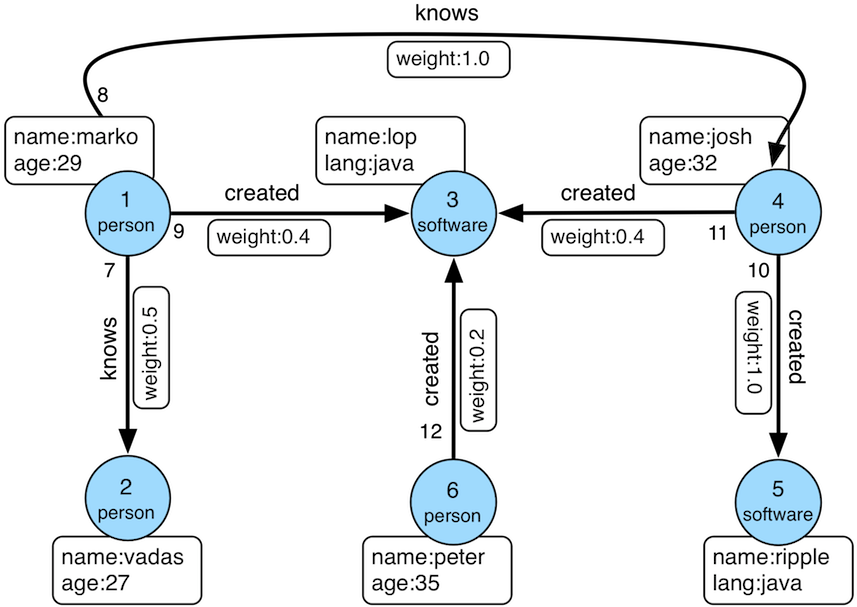

# Gremlin Console
* Download gremlin console - https://www.apache.org/dyn/closer.lua/tinkerpop/3.6.1/apache-tinkerpop-gremlin-console-3.6.1-bin.zip
* open gremlin console
```
C:\....\apache-tinkerpop-gremlin-console-3.6.1-bin\apache-tinkerpop-gremlin-console-3.6.1>bin\gremlin.bat
```
* create modern graph. This contains graph with 6 nodes for practice
```
graph = TinkerFactory.createModern()
```
* create graph traversal
```
g = traversal().withEmbedded(graph)
```
* count nodes
```
g.V().count()
```
* exit gremlin console
```
:exit
```
* clear gremlin console
```
:cls
:C
```
* Gremlin console docker container - https://hub.docker.com/r/tinkerpop/gremlin-console
------
# Gremlin commands
* Setup gremlin console to practice below commands - [Gremlin Console](#Gremlin-Console)
* create graph object with 6 nodes for practice
```
graph = TinkerFactory.createModern()
```
* above command creates following graph\

* create new graph without existing nodes or edges
```
graph = TinkerGraph.open()
```
* create graph traversal
```
g = traversal().withEmbedded(graph)
```
* count nodes
```
g.V().count()
```
* get all nodes
```
g.V()
```
* count all edges
```
g.E().count()
```
* get all edges
```
g.E()
```
* Row number or limit the number of nodes
```
g.V().limit(10)

g.V().hasLabel("labelValue").limit(10)
```
* node with id 1
```
g.V(1)
```
* get node `id`
```
g.V().limit(1).id()
```
* get node `label`
```
g.V(id).label()
```
* query by label
```
g.V().hasLabel("labelValue")
```
* remove duplicates
```
g.V().hasLabel("labelValue").dedup()
```
* drop remove delete nodes with label
```
g.V().hasLabel("labelValue").drop()
```
* drop remove delete node with id
```
g.V(id).drop()
```
* drop remove delete property
```
g.V().hasLabel("labelName").properties("propertyName").drop()
```
* get edge with label
```
g.E().hasLabel("labelName")
```
* drop remove delete edge with label
```
g.E().hasLabel("labelName").drop()
```
* get name property of node with id 1
```
g.V(1).values("name")
```
* out edges from node with id 1
```
g.V(1).outE()
```
* edge with label `knows` coming out from node with id 1
```
g.V(1).outE("knows")
```
* nodes with out edge `knows` from node 1
```
g.V(1).outE("knows").inV().values("name")
g.V(1).out("knows").values("name")
g.V(1).out("knows")
```
* nodes with out edge `knows` from node 1 and `age > 30`
```
g.V(1).out("knows").has("age", gt(30)).values("name")
```
* nodes with out edge `knows` from node 1 and `age < 30`
```
g.V(1).out("knows").has("age", lt(30)).values("name")
```
* nodes with out edge `knows` from node 1 and `age == 30`
```
g.V(1).out("knows").has("age", eq(30)).values("name")
```
* create node n1. label - person, properties - id, name, age
```
n1 = g.addV("person").property(id, 1).property("name", "marko").property("age", 29).next()
```
* create node n2. label - software, properties - id, name, lang
```
n2 = g.addV("software").property(id, 3).property("name", "lop").property("lang", "java").next()
```
* create edge from n1 to n2. properties - id, weight
```
g.addE("created").from(n1).to(n2).property(id,9).property("weight", 0.4)
```
* add edge between existing nodes. properties - weight
```
g.V("node1Id").as("n1").V("node2Id").as("n2").addE("edgeLabel").from("n1").to("n2").propety("weight", 0.5)
```
* node with name property equal to marko
```
g.V().has("name", eq("marko")).values("name")
g.V().has("name", eq("marko"))
```
* node with `label==person`, `name==marko`
```
g.V().has("label", "property", "value")
g.V().has("person", "name", "marko")
```
* out edge with `label==created` from node with `label==person` and `name==marko` 
```
g.V().has("person", "name", "marko").outE("created")
```
* nodes with out edge `label==created` from node with `label==person` and `name==marko`
```
g.V().has("person", "name", "marko").outE("created").inV()
g.V().has("person", "name", "marko").out("created")
```
* `age` property of nodes with `label==person` and `name in (vadas ,marko)`
```
g.V().has("person", "name", within("vadas","marko")).values("age")
```
* average `age` of nodes with `label==person` and `name in (vadas ,marko)`
```
g.V().has("person", "name", within("vadas", "marko")).values("age").mean()
```
* node with out edge `label==created` from node with `label==person` and `name=marko`
```
g.V().has("person", "name", "marko").out("created")
```
* nodes providing `in` edge with `label==created` to the node that has `out` edge with `label==created` from node with `label==person and name==marko`
```
g.V().has("person", "name", "marko").out("created").in("created")

gremlin> g.V().has("person", "name", "marko")
==>v[1]
gremlin> g.V().has("person", "name", "marko").out("created")
==>v[3]
gremlin> g.V().has("person", "name", "marko").out("created").in("created")  -> nodes providing `in` edge to v[3]
==>v[1]
==>v[4]
==>v[6]
```
* excluding node from final result nodes
```
g.V().has("person", "name", "marko").as("exclude").out("created").in("created").where(neq("exclude"))

gremlin> g.V().has("person", "name", "marko")
==>v[1]
gremlin> g.V().has("person", "name", "marko").as("exclude")
==>v[1]
gremlin> g.V().has("person", "name", "marko").as("exclude").out("created")
==>v[3]
gremlin> g.V().has("person", "name", "marko").as("exclude").out("created").in("created")
==>v[1]
==>v[4]
==>v[6]
gremlin> g.V().has("person", "name", "marko").as("exclude").out("created").in("created").where(neq("exclude"))
==>v[4]
==>v[6]
```
* Gremlin to iterate through all vertices and traverse out twice from each. Gremlin will label each vertex in that path with "a", "b" and "c", respectively. We can then use select to extract the contents of that label
```
g.V().as("a").out().as("b").out().as("c").select("a", "b", "c")
```
* order by label ascending order
```
gremlin> g.V().order().by(label, desc).valueMap(true)
==>[id:3,label:software,name:[lop],lang:[java]]
==>[id:5,label:software,name:[ripple],lang:[java]]
==>[id:1,label:person,name:[marko],age:[29]]
==>[id:2,label:person,name:[vadas],age:[27]]
==>[id:4,label:person,name:[josh],age:[32]]
==>[id:6,label:person,name:[peter],age:[35]]
```
* group by label
```
g.V().group().by(label)
==>[software:[v[3],v[5]],person:[v[1],v[2],v[4],v[6]]]
```
* group by label and display names
```
g.V().group().by(label).by("name")
```
* get all nodes with properties. do not get `id` and `label`
```
g.V().valueMap()
```
* get properties of node
```
g.V("nodeId").properties()
```
* get all properties of vertex with id 1
```
g.V(1).valueMap()
```
* get `id` and `label` also with other properties
```
g.V(1).valueMap(true)
```
* node with id `outVertextId` from node with id `id1` with out edge label `edgeLabel1`
```
g.V("id1").out("edgeLabel1").hasId("outVertextId")
```
* node with proeprty name containing. `label` is optional
```
g.V().has("property", TextP.containing("value"))
g.V().has("name", TextP.containing("ji"))

g.V().has("label", "property", TextP.containing("value"))
g.V().has("person", "name", TextP.containing("ji"))

gremlin> g.V().has("person", "name", TextP.containing("jo")).valueMap(true)
==>[id:4,label:person,name:[josh],age:[32]]
gremlin> g.V().has("person", "name", containing("jo")).valueMap(true)
==>[id:4,label:person,name:[josh],age:[32]]
```
* get all edges going out from node
```
g.V().hasLabel("labelName").outE().label().dedup()
```
* get all `in` edges to node with `label=labelName`
```
g.V().hasLabel("labelName").inE().label().dedup()
```
* node with label and not has property
```
g.V().hasLabel("label").hasNot("property").valueMap()
```