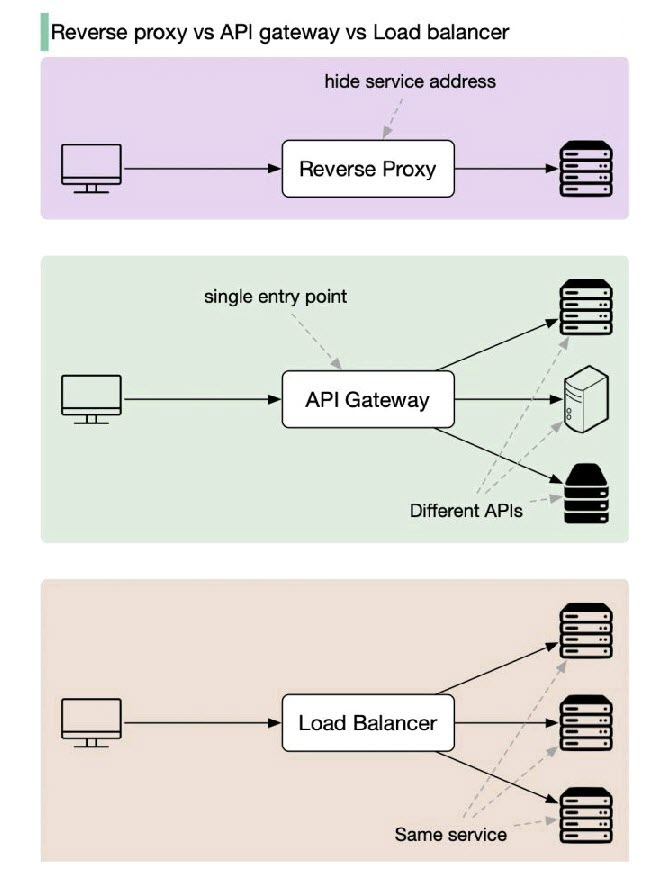

### [<<Back](../README.md) | [Java V2 All Examples](https://github.com/avinashbabudonthu/java/blob/master/java-v2/README.md) | [Java All Examples](https://github.com/avinashbabudonthu/java/blob/master/README.md)
------
# Reverse proxy vs API Gateway vs Load Balancer
* High level diagram\

------
# Reverse Proxy
* Acts as intermediary between clients and backend servers
* Key features includes
    * Returns data requests on behalf of backend servers
    * Shielding sensitive infrastructure from external probing
------
# API Gateway
* Sits between client and backend services, act as single entry point
* It routes requests to appropriate services
* Useful for
    * Organizing communication between frontends and backends
    * Avoiding exposing all services publicly
------
# Load Balancer
* Distributed network traffic across multiple instances of same service. Preventing overload on any single instance
* Useful for managing high traffic loads without downtime
------
### [<<Back](../README.md) | [Java V2 All Examples](https://github.com/avinashbabudonthu/java/blob/master/java-v2/README.md) | [Java All Examples](https://github.com/avinashbabudonthu/java/blob/master/README.md)