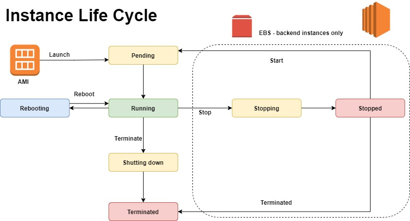
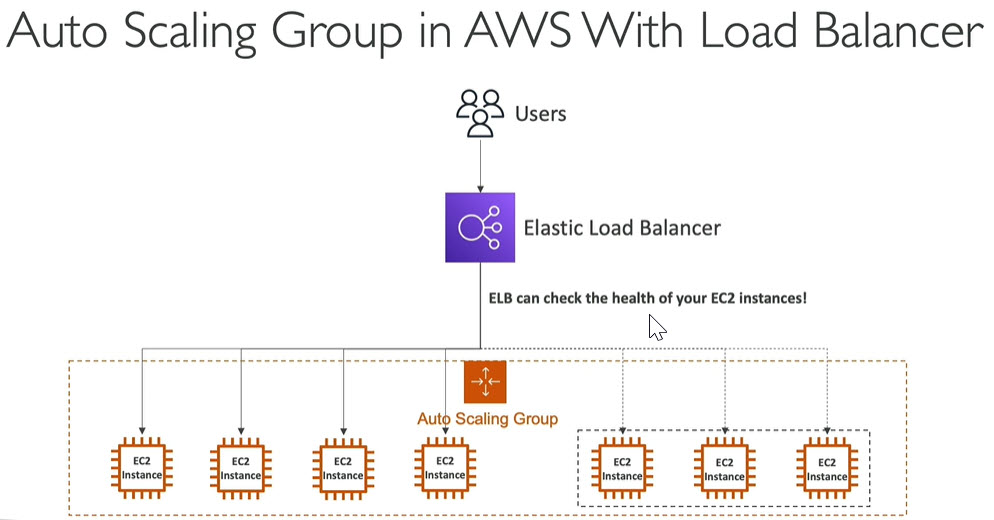
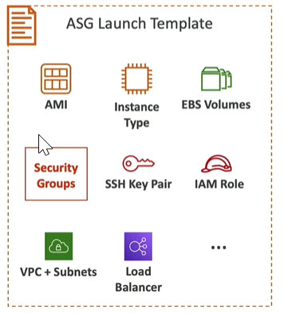
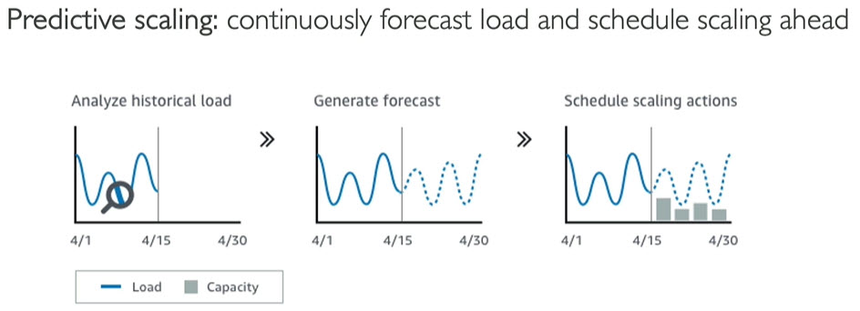
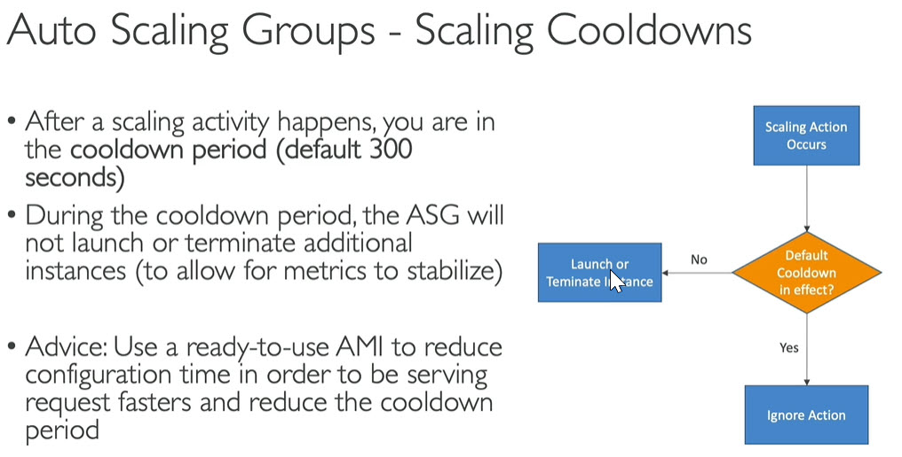
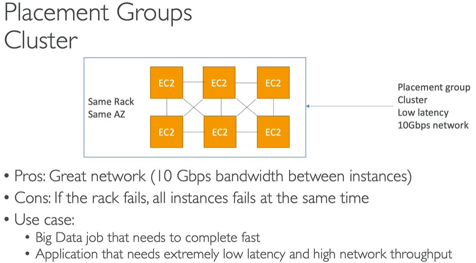
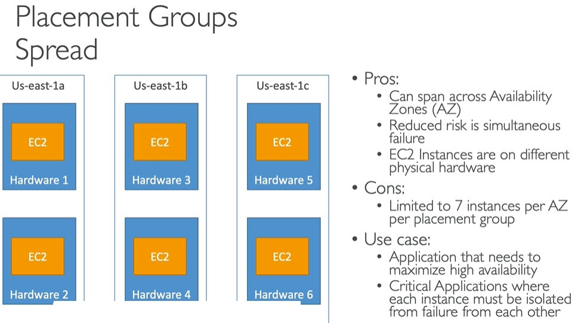
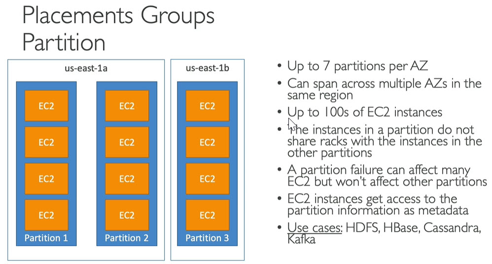

# EC2 Elastic Compute Cloud

------
# Links
* EC2 instance types - https://aws.amazon.com/ec2/instance-types/
* Compare EC2 instances - https://ec2instances.info
------
# Important port numbers to know to work with EC2 instances

------
# EC2 Instances Purchasing Options

------
# Instance Family and use cases
* General purpose (t2, m4, m3)
	* Low traffic websites and web applications
	* Small and mid-size databases
* Compute optimized (c4, c3)
	* High performance front ends like gaming
	* Video encoding
* Memory optimized (r3)
	* High performance databases
	* Distributed memory caches
* Storage optimized (i2, d2)
	* Data warehousing
	* Log or data-processing applications
* GPU instances (g2)
	* 3D application streaming
	* Machine learning
	* Graphic based applications
------
# Instance metadata
* Data about instances
* Public IP of instance
* Can be used to configure or manage running instance
* Getting instance metadata
	* Window instance - open url - http://169.254.169.254/latest/meta-data/
	* Linux instance - curl url from instance
		* $ curl http://169.254.169.254/latest/meta-data/
		* $ GET http://169.254.169.254/latest/meta-data/
* all meta data is returned as text (content type text/plain)
------
# Instance user data
* You can specify user data when launching the instance
* user data can be
	* linux script - executed by cloud-init
	* windows batch or powershell scripts - executed by EC2Config service
* user data scripts run once per instance-id by default
* user data is limited to 16KB
* user data should be Base64 encoded before submitted to API. Amazon EC2 command line tools can perform Base64 encoding
* Getting user data - http://169.254.169.254/latest/user-data
* Sample user data script to start web server
```
#!/bin/bash
# Use this for your user data (script from top to bottom)
# install httpd (Linux 2 version)
yum update -y
yum install -y httpd
systemctl start httpd
systemctl enable httpd
echo "<h1>Hello World from $(hostname -f)</h1>" > /var/www/html/index.html
```
* User data script with Availability zone informaion
```
#!/bin/bash
# Use this for your user data (script from top to bottom)
# install httpd (Linux 2 version)
yum update -y
yum install -y httpd
systemctl start httpd
systemctl enable httpd
EC2_AVAIL_ZONE=$(curl -s http://169.254.169.254/latest/meta-data/placement/availability-zone)
echo "<h1>Hello World from $(hostname -f) in AZ $EC2_AVAIL_ZONE</h1>" > /var/www/html/index.html
```
------
# What is EC2
* Service provided by AWS for computing needs
* Computing services operating in remote data servers around the world
------
# What we can do with EC2 instance?
* Instance is a computer
* To run an application
* Login and use it like a virtual machine
------
# What is Elastic means in EC2?
* Instance running computing operations can increase and decrease at will
------
# What is instance?
* Virtual server
------
# Create EC2 instance
* Login to Amazon web console
* click on EC2
* click Launch Instance button
* Select any image
* Select instance Type
* click on `Next: Configure Instance Details` button
* Select Number of instances (replications of same image)
* click on `Next:Add Storage` button
* click `Next: Tag Instance` button
* click `Next: Configure Security Group` button
* click `Review and Launch` button
* click `Launch` button
* select security key pair option
* click `Launch Instances` button
------
# Create EC2 instance
* Login to Amazon web console
* click on EC2
* click Launch Instance button
* click Select button of any image we want
* select instance type we want, as of now I am selecting free ties instance type
* click Next: Configure Instance Details button
* give Number of instances as 1 (we can increase while giving AutoScaling configurations)
* For Network select VPC we have created
* Select any subnet under that VPC
* Auto Assign Public IP: Disable
* leave rest section to defaults
* click Next: Add Storage button
* keep defaults
* click Next: Tag Instance button
* Give Name to instance
* click Next: Configure Security Group
* give Security Group Name `any name for example security-group-1`
* enter description
* click Add Rule button
* keep Type `Custom TCP Rule`
* Port Range = 3000
* Source == Anywhere in the drop down
* click Review and Launch button
* click Launch button
* popup opens asking for key-pair
* select `Create a new key pair` in the first drop down
* give key pair name
* click Download Key pair button
* this will download a .pem file
* save and keep it safe
* click Launch Instances button
------
# Getting inside virtual machine with EC2 and VPC
* AWS Console
* click EC2
* open EC2 dashboard
* click 1 Running Instances under Resources
* navigates to instance dashboard
* at the bottom
* under Description we can see there is no  Public IP for this instance
* We can see Private IP
* we can see Availability Zone where this instance has been created
* we can see Key Pair, this is important because we will use same key-pair to connect via SSH
------
# Create and Assign Public IP address to VPC
* To assign this instance an IP address first we need to create an Elastic IP
* AWS Console
	* EC2
	* click Elastic IPs in the left menu
	* click Allocate New Address button
	* click Yes, Allocate button in the popup
	* click Close button
	* Now we have public IP address
* select Elastic IP created above
	* click Actions button
	* click Associate Address
	* On clicking Instance text box auto suggestion will come, select intance to which we want to assign this IP
	* click Associate button
	* Elastic IP address will be updated with EC2 instance that this IP address is associated with
	* click on instance link
	* navigates to instance details
	* here we can see Public IP address assigned to this instance
	* Copy this IP address so that we can use it in next configurations
------
# Elastic IP
* Public IP addresses that are created, destroyed and assigned independently to EC2 instances
* If underlying instance is terminated then associated IP address can still exist and can be assigned to different instance
------
# Convert pem file to ppk file
* Open PuttyGen
	* Actions
	* click Load button
	* selecte .pem file we have downloaded above
	* click Generate button
	* click Save Private Key button
	* This will generate .ppk file, save it carefully
------
# Connect to EC2 instance via SSH
* Downlod Putty
* Download puttyGen
* Open PuttyGen
	* Actions
	* click Load button
	* selecte .pem file we have downloaded above
	* click Generate button
	* click Save Private Key button
	* This will generate .ppk file, save it carefully
* Open Putty
	* Expand Connection
	* Expand SSH
	* Select Auth
	* Browse
	* select .ppk file generated above
	* click Session on left pane
	* In Host Name text box enter `ec2-user@ec2-instance-public-DNS`
	* click Open
	* EC2 instance will be connected
* Reference - [https://docs.aws.amazon.com/AWSEC2/latest/UserGuide/putty.html?icmpid=docs_ec2_console](https://docs.aws.amazon.com/AWSEC2/latest/UserGuide/putty.html?icmpid=docs_ec2_console)
* After connecting to EC2 instance using Putty -> run this command
	* sudo yum update
------
# Connecting from Windows 10 or later
* Open cmd or powershell
* Navigate to path where `pem` file is present
* Run below command
```
ssh -i pemfile ec2-user@ip-address
```
------
# Connect using EC2 Instance connect
* Login to aws console
* Go to EC2 dashboard
* Select EC2 instance which we want to connect
* Click on `Connect` button
* Opens new tab in browser and connects to EC2 instance
------
# AMI
* AMI means `Amazon Machine Image`
* Operating System + preinstalled softwares like Java, perl, python etc used on an EC2 instance
* AMIs are customization of EC2 instance
	* Add your own software, configuration, operating system, monitoring
	* Faster boot/configuration time because all softwares are pre-packaged
* AMIs are built for specific region (Can be copied across region)
------
# Storage termed as
* EBS (Elastic Block Storage) in EC2. EBS is specific to storage used by EC2. EBS is not same as S3
* Independent storage volumes used with EC2 instances
------
# Security Groups
* Little firewals installed per instance basis
------
# EC2 dashboard 
* Resources: Details of instances/resources we have created
* Running Instances: EC2 instances we have
* Volumes: Elastic Block Storage volumes
* Launch Instance button: To launch new EC2 instance
------
# Scaling EC2 instances
* Expand or Shrink pool of instances
------
# Auto Scaling Group
* Expand or Shrink pool of instances based on pre-defined rules
* Auto configuration has launch configuration which has an image in it, and scaling rules to expand or shrink a pool of instances automatically
* In real life, load on your application can change time to time (sometimes high and sometimes low)
* In the cloud, you can create and get rid of servers very quickly
* Goal of Auto scaling groups (ASG)
	* Scale out (add EC2 instances) to match increased load
	* Scale in (remove EC2 instances) to match decreased load
	* Enusure we have minimum and maximum number of EC2 instances Running
	* Automatically register new instances to load balancer
	* Recreate EC2 instance in case previous one is terminated
* ASG is free (you pay only for underlying EC2 instances)\

* Auto scaling group with load balancer


## Auto scaling group attributes
* A launch template (older launch configurations are deprecated)
	* AMI + Instance type
	* EC2 user Data
	* EBS volumes
	* Security Group
	* SSH
	* IAM roles for EC2 instances
	* Network + Subnet informaion
	* Load balancer information\

* ASG has min size, max size, initial capacity
* Scaling Policies

## Scaling Policies
* Auto scaling - CloudWatch alarms & scaling
* It is possible to scale ASG based on CloudWatch alarms
* An alarm monitors metric (such as average CPU, custom metric)
* Metrics such as average CPU are computed for the overall ASG Instances
* Based on the alarm
	* We can create scale-out policies (increase number of instances)
	* We can create scale-in policies (decrease number of instances)\

* Dynamic scaling
	* Target tracking scaling
		* simple to setup
		* I want the average ASG CPU to stay at around 40%
	* Simple / Step Scaling
		* When cloudWatch alarm is triggered (example CPU > 70%) then add 2 units
		* When CloudWatch alarm is triggered (example CPU < 30%) then remove 1 unit
* Scheduled Scaling
	* Anticipate scaling based on known usage patterns
	* Example: Increate the minimum capacity to 10 at 5 PM on Friday
* Predictive Scaling


## Good metric to scale on
* CPU Utilization: Average CPU utilization across your Instances
* Request Count per target: To make sure the number of requests per EC2 instance is stable
* Average Network In / Out (if your application is network bounded like lot of uploads and downloads)
* Any custom metrics (that you push using CloudWatch)

## Auto scaling groups - Scaling cooldowns

------
# Creating an AMI from Ec2 Instance
* AWS console
* click EC2
* open EC2 dashboard
* click on instances in the left menu
* Select our instance we want to create AMI
* click on Actions button open drop down
* Image
* click Create Image
* give image name (any user defined name)
* leave rest as defaults
* click Create Image button
* click Close button
* We have an AMI created and ready for deployment
------
# Where to check our AMI
* AWS console
* click EC2
* open EC2 dashboard
* click on instances in the left menu
* click Launch Instance button
* click My AMIs tab
* we can see AMI we have created
* We can also see AMIs in :
	* EC2 dashboard
	* AMIs in left menu
------
# Deleting an EC2 Instance
* AWS console
* EC2
* instances in the left menu
* select the instances we want to delete
* Actions drop down
* Instance State
* Terminate
* click Yes, Terminate button
* this will take some time
------
# placement groups




------
# EC2 Instance Store
* EBS volumes are network drives with good but `limited` performance
* if we need high performance hardware disk then use EC2 Instance store
* Better IO performance because no network latency
* EC2 Instance store lost thier storage if they are stopped
* Good for buffer/cache/temporary Data
* Risk of data loss if hardware fails
* Backup and replication are your responsibility