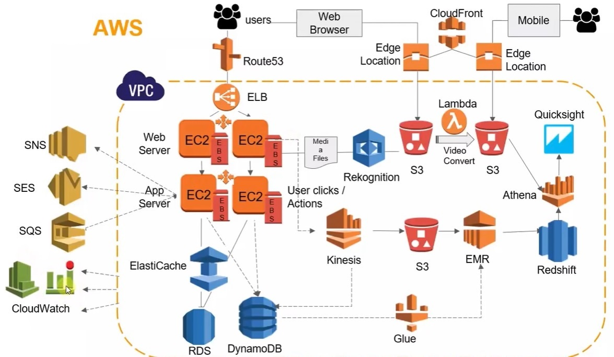
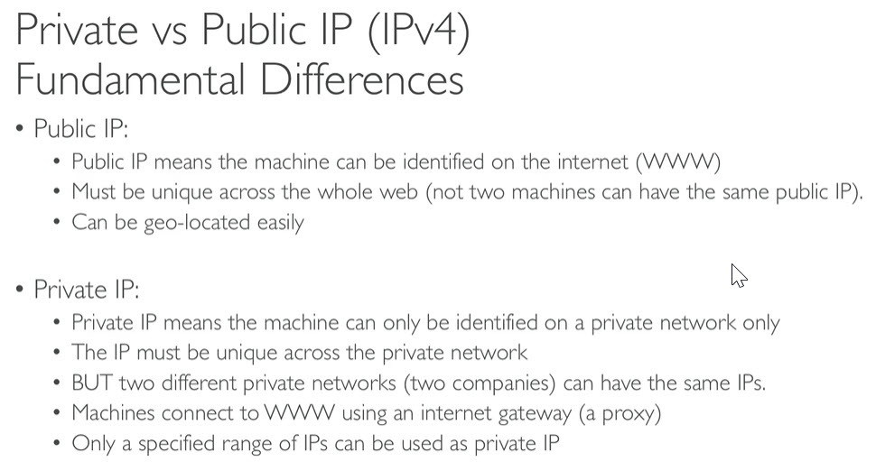

# Introduction to AWS services
------
# Important Links:
* Console - http://aws.amazon.com
* Certification - https://aws.amazon.com/certification
* AWS infrastructure - https://infrastructure.aws
* AWS Global Infrastructure - https://aws.amazon.com/about-aws/global-infrastructure/regions_az/
------
# AWS History
* Started on 2002
* 2004 - Launched SQS
* 2006 - SQS, S3, EC2
* 2007 - Launched in Europe
------
# How to choose aws region:
* Compliance - data stays within same geo area
* Proximity - reduced latency
* Available services
* Pricing
------
# AWS Global Data Centers
* Data Center -> Availability Zone -> Region
* `Data Centers`: facility that provides shared access to applications and data using a complex network, compute, and storage infrastructure
* `Availability Zones`: 2 or more data centers are called `Availability Zones`
* `AWS Region`: 3 or more availability zones are called `Region`. Whenever we are using AWS services typically we deploy our application in AWS geographical area. That geographical area is called `AWS Regions`
* Across world there are different AWS regions available
* When we deploy services, we can choose which regions we need to deploy
* `Edge Locations`: Used for caching. Our content like media, videos, pictures are cached in the nearest AWS data center locations and delivered to users. It improves performance by lowering the network latency
* AWS have `130+ services` like EC2, S3 etc\

* Each `Region` will have 3 or more availability zones. Minimum 3 and maximum 6
* when we are deploying our application we need to keep in different availability zones so that if one of the availability zone goes down then our application still running on another availability zone. So our application will have high availability
* Services and at what level they work\

* Following services work at account level
	* Billing
	* IAM - Identity and Access Management
	* Route53
* Region level services
	* S3
	* DynamoDB
* Availability zone level
	* EC2
	* RDS
	* EBS
* General application architecture\

* Above application architecture with AWS services\

* Application services\

* Security services
	* IAM - Identity and Access Management
	* KMS - Key Management Service
		* To encrypt data
	* ACM - Amazon Certificate Manager
		* For digital certificates to write https APIs and security
	* WAF - Web Application Firewall
		* Application firewalls
	* Inspector
		* Keep in EC2 instances
		* Scans instances for any vulnerabilities. This is used for getting compliance like HIPPA etc\

* Development and Devops services
	* CloudFormation
		* Takes template in `json` or `yaml` format
		* Create infrastructre with all services (check image above) from scratch
	* CodeCommit
		* Similar to GIT where we can check in the code
	* CodeBuild
		* To build application
		* Takes source code (written Java, Python etc) and builds it using build tools like Maven, Gradle etc
		* Produces artifacts (application executables)
	* CodeDeploy
		* For deployment
		* To deploy artifacts in EC2
	* CodePipeline
		* To build CI pipeline with above services
	* CodeStar
		* Project management
		* Issue tracking\

------
# Cloudwatch

------
# Billing And Budget Setup
* By default IAM users will not have access to Billing dashboard
* Login to root account
* Go to billing dashboard
	* Click on username on top right
	* My Account
* Search for `IAM User and Role Access to Billing Information`
	* Edit
	* Select `Activate IAM Access` check box
	* Click `Update` button
* Setting Budget
	* Go to billing dashboard
	* Click on `Budgets` on left menu
	* Click `Create a budget` button
	* Select appropriate options
	* Enter required details
------
# Naming conventions
* IAM - Identity and Access Management
* KMS - Key Management Service 
* AMI - Amazon Machine Image
* NAT - Network Address Translation
* ACL - Access Control List
* NACL - Network Access Control List
* WAF - Web Application Firewall
* EIP - Elastic IP addresses
* ASG - Auto Scaling Group
* ACM - Amazon Certificate Manager (or) AWS Certificate Manager
* SG - Security Groups
* EFS - Elastic File Service
* AES - Advanced Encryption Standard
* IPAM - IP Address Manager
* ARN - Amazon Resource Names
* ENI - Elastic Network Interfaces
* IOPS - IO Operations per Second
* PIOPS - Provisioned IOPS
* FSR - Fast Snapshot Restore
* ELB - Elastic Load Balancing
* CLB - Classic Load Balance
* ALB - Application Load Balancer
* GWLB - Gateway Load Balancer
* UDP - User Datagram Protocol
* IDPS - Intrusion Detection and Prevention Systems
* DPIS - Deep Packet Inspection System
* SNI - Server Name Indication
* ALPN - Application Layer Protocol Negotiation
* DR - Disaster Recovery
* HA - High Availability
* ACU - Aurora Capacity Unit
* TTL - Time To Live
* TLD - Top Level Domain
* SLD - Second Level Domain
* FQDN - Fully Qualified Domain Name
* URL - Uniform Resource Locator
------
# Private vs Public IPs

------
# List of Ports to be familiar with
* Here's a list of standard ports
* Important ports:
	* SSH: 22
	* FTP: 21
	* SFTP: 22 (same as SSH)
	* HTTP: 80
	* HTTPS: 443
	* RDP (Remote Desktop Protol) used to connect windows machines: 3389
* RDS Databases ports:
	* PostgreSQL: 5432
	* Aurora
		* PostgreSQL compatible: 5432
		* MySQL compatible: 3306
	* MySQL: 3306
	* MariaDB: 3306 (same as MySQL)
	* Oracle RDS: 1521
	* MSSQL Server: 1433
------
# AWS global services
* IAM
* Route 53
* CloudFront (CDN)
* WAF
------