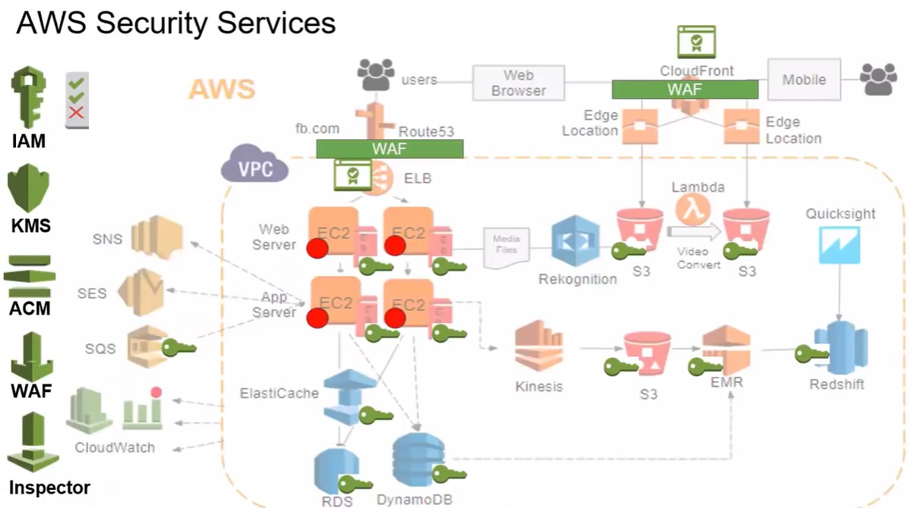
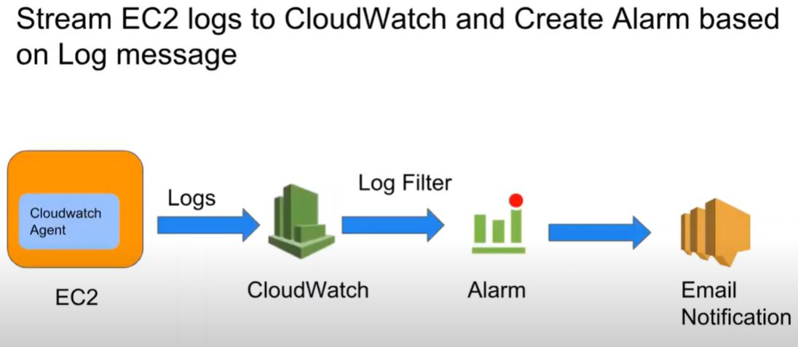

# AWS Notes

# Services
* Elastic Cloud Compute - EC2
* Virtual Private Cloud - VPC
* Simple Storage Service - S3
* RDS
	* MySQL
	* Sql Server
	* Oracle
	* MariaDB
	* Amazon Aurora
	* PostgreSQL
	* SQLServer
* Dynamo DB - Document DB
* Redshift - Data warehouse
* Route53
* Elastic beanstalk - EB
* CloudFront
* Clout Watch - Collect and store logs and alert when application fails
* Simple Queue Service - SQS
* Web console
* Command line utility
* Software Development Kit - SDK
* Robomaker
* Load Balancing
* Ground Station
* Bracket
* LightSail
* Lambda
	* Functions as a service
	* Serverless computing
* Serverless Repo
	* Outposts
	* Snow
* Docker
	* Container Registry
	* ECS - Elastic Container Service
	* EKS - Elastic Kubernetes Services
	* Fargate
	* App Runner
* File Storage
	* Simple Storage Service - S3
	* Glacier
	* Elastic Block Storage - EBS
	* Elastic File System - EFS
* Simple DB - No SQL
* Graph DB
	* Neptune
* Elastic Cache
	* Timestream
	* Quantum Ledger
* Analytics
* Lake Formation
* Kinesis
* Elastic Map Reduce
* Amazon MSK - Kafka
* Glue
* Machine Learning
	* Sagemaker
	* Rekognition
	* LEX
	* Deep Racer
* Developer Essentials
	* IAM
	* Cognito
	* SNS - Simple Notification Service
	* SES - Simple Email Service
	* Cloud Formation
	* Amplify
	* Budgets
------
# Introduction to AWS services

## AWS Global Data Centers
* `AWS Region`: Whenever we are using AWS services typically we deploy our application in AWS geographical area. That geographical area is called `AWS Regions`
* Across world there are different AWS regions available
* When we deploy services, we can choose which regions we need to deploy
* `Data Centers`: Every region contains - 2 or more data centers for high availability of AWS services
* `Availability Zones`: 2 or more data centers are called availability zones
* `Edge Locations`: Used for caching. Our content like media, videos, pictures are cached in the nearest AWS data center locations and delivered to users. It improves performance by lowering the network latency
* AWS have `130+ services` like EC2, S3 etc\

* Each `Region` will have 2 or more availability zones
* when we are deploying our application we need to keep in different availability zones so that if one of the availability zone goes down then our application still running on another availability zone. So our application will have high availability
* Services and at what level they work\

* Following services work at account level
	* Billing
	* IAM - Identity and Access Management
	* Route53
* Region level services
	* S3
	* DynamoDB
* Availability zone level
	* EC2
	* RDS
	* EBS
* General application architecture\

* Above application architecture with AWS services\

* Application services\

* Security services
	* IAM - Identity and Access Management
	* KMS - Key Management Service
		* To encrypt data
	* ACM - Amazon Certificate Manager
		* For digital certificates to write https APIs and security
	* WAF - Web Application Firewall
		* Application firewalls
	* Inspector
		* Keep in EC2 instances
		* Scans instances for any vulnerabilities. This is used for getting compliance like HIPPA etc\

* Development and Devops services
	* CloudFormation
		* Takes template in `json` or `yaml` format
		* Create infrastructre with all services (check image above) from scratch
	* CodeCommit
		* Similar to GIT where we can check in the code
	* CodeBuild
		* To build application
		* Takes source code (written Java, Python etc) and builds it using build tools like Maven, Gradle etc
		* Produces artifacts (application executables)
	* CodeDeploy
		* For deployment
		* To deploy artifacts in EC2
	* CodePipeline
		* To build CI pipeline with above services
	* CodeStar
		* Project management
		* Issue tracking\

------
# AWS Cloudwatch Notes Stream EC2 logs to Cloud watch and create alarm based on log message

------
# Billing And Budget Setup
* By default IAM users will not have access to Billing dashboard
* Login to root account
* Go to billing dashboard
	* Click on username on top right
	* My Account
* Search for `IAM User and Role Access to Billing Information`
	* Edit
	* Select `Activate IAM Access` check box
	* Click `Update` button
* Setting Budget
	* Go to billing dashboard
	* Click on `Budgets` on left menu
	* Click `Create a budget` button
	* Select appropriate options
	* Enter required details
------
# Naming conventions
* NAT - Network Address Translation
* EIP - Elastic IP addresses
* AMI - Amazon Machine Images
* Elastic Beanstalk
	* service that makes it easy to run our code and scale it on AWS. Under the cover this will simply run our code in EC2
* Dynamo DB
	* NoSQL database from AWS. Supports both document and key-value store models
* Redshift
	* Amazon data warehousing solution
* Cloud watch
	* monitoring service for other aws services
	* Alerting service for other aws services
	* Can be configured to monitor logs. For this we need configure awslogs agens on EC2 instance and tell which logs to send to cloud watch
* Cloud Front
	* this is content delivery network that allows to serve files globally