# RDS Relational Database Services
* Collection of AWS services to manage relational databases
* Managed database aspects and benefits
	* AWS will take care of
		* Scheduled automated backups
		* Software Updates
		* Managed infrastructure
		* configure security groups for database security
* RDS databases managed by AWS
	* Oracle
	* Microsoft SQL Server
	* MySQL
	* Postgres
	* Maria DB
	* IBM DB2
	* Aurora (AWS Proprietary database)
* RDS pricing depends on
	* type of database
	* region
	* EC2 instance type
------
# Create PostgreSQL database instance
* AWS web console
* RDS
* Left side we can see dashboard menu
* If we are coming here for the first time, we can see Get Started Now button
* click on Get Started Now button
* Select the database engine we want to create (I am selecting PostgreSQL)
* click on Select button 
* select the purpose for creating this DB instance (production - for creating Multy A(vailibility)-Z(one) database, Dev/Test - single instance), i am selecting Dev/Test
* click on Next Step button
* Fill the details appropriately
* click Next Step button
* VPC drop down: select our VPC created before. Check [here](https://github.com/avinashbabudonthu/aws/tree/master/vpc) to know how to create VPC
* Publicly Accessable: yes
* Database Name: any user defined name
* keep the rest of options to defaults
* click Launch DB Instance button
* This will take some time
------
# Security group created for the database created above
* AWS web console
* RDS
* click on Instances on left menu
* Expand database row
* click on magnifying glass document icon
* click on link available for Security Groups
* click on Inbound tab
* here we can see port for connecting to PostGre SQL DB
* IP Address will be default to our system IP address. If we want to change IP Address
* click on Edit button
* change Source to Anywhere
* click Save button
------
# Connecting to PostGre database created above
* We need to use any of the below tools
	* Postico
	* pgAdmin
* Open Postico
	* click on New Favorite button
	* Nickname: local nick name for DB
	* Host: expand database row in AWS RDS web console, copy End point
	* Port: port our database is running
	* enter username and password
	* enter database name what we gave while creating DB
	* click Connect button
	* now connected to DB
------
# create table in PostGre database created above
* After connecting to database
* click on `+Table` button
* give table name, column names etc
* click Save Changes button
------
# Advantages of using RDS versus deploying DB in EC2
* RDS managed Services
	* Automated provisioning, OS patching
	* Continuous backups and restore to specific timestamp (Point in Time Restore)
	* Monitoring Dashboard
	* Read replicas for improved read performance
	* Multi AZ setup for DR (Disaster Recovery)
	* Maintenance window for upgrades
	* Scaling capability (Horizontal and Vertical)
	* Storage backed by EBS (gp2 or IO1)
* BUT we can't SSH into your RDS running instances
------
# RDS Storage Auto Scaling
* Helps you increase storage on your RDS DB instance dynamically
* When RDS detects that you are running out of storage, it scales automatically
* Avoid manual scaling your database Storage
* You have to set `Maximum storage threshold` (Maximum storage limit for DB storage)
* automatically modify Storage if
	* Free storage is `< 10%` of allocated Storage
	* Low storage lasts atleast 5 min
	* 6 hours have passed since last modification
* Useful for application with unpredictable work loads
* Supports all RDS database engines\

------
# RDS Read Replicas vs Multi AZ
* Upto 15 Read replicas
* Within AZ, Cross AZ, Cross region
* Replication is ASYNC, so reads are eventually consistent
* Replicas can be promoted to their own DB. Means we can make read replica as main db, then it will be out from read replicas list and have it's own database life cycle
* Applications must update the connection string to leverage read replicas\
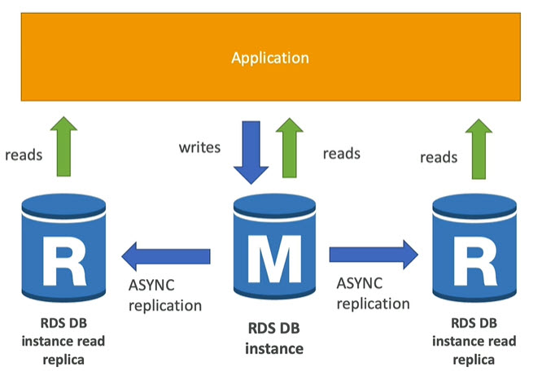
------
# RDS Read Replicas Use Cases
* You have production database taking normal load
* You want to run some reporting application to run some analytics
* You create `Read Replica` to run new workload
* The production application is unaffected
* Read replicas are used for `SELECT` only kind of statements (not INSERT, UPDATE, DELETE)\

------
# Read replica network cost
* In AWS there is network cose when data goes from one AZ to another
* For RDS Read Replicas with in same region (means different AZ with in same region) then it is free
* Pay only if read replica is in another region\
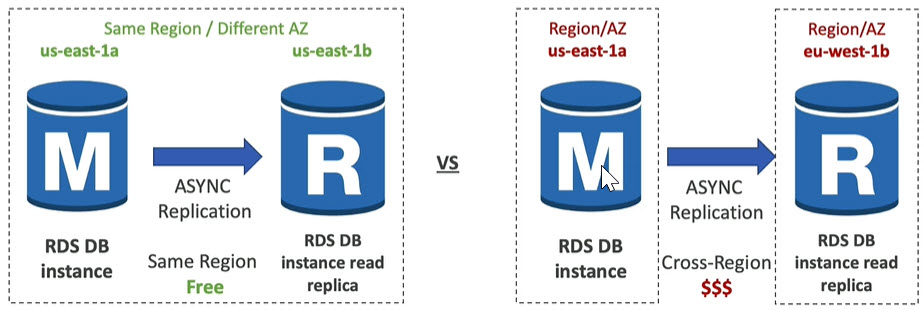
------
# RDS Multi AZ DR - Disaster Recovery
* Sync replicas - instant replication to standby instance
* One DNS name - automatic app failover to standby
* Increase availability
* Failover in case of loss of AZ, loss of network, instance or storage failure
* No manual intervention in apps
* Not used for scaling
* Read replicas can be setup as Multi AZ for DR\

------
# RDS - from single Az to multi AZ
* Zero downtime operation (no need to stop DB)
* Just click on `modify` for the Database
* Following steps happens internally
	* Snapshot is taken
	* New DB is restored from Snapshot in new AZ
	* Synchronization is established between two databases\
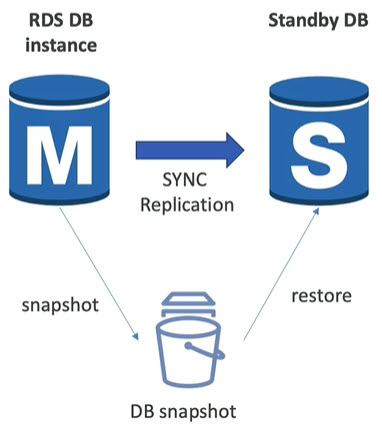
------
# RDS Custom
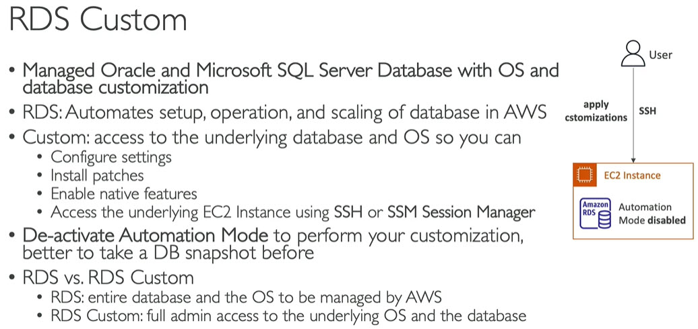
------
# Amazon Aurora
* Properietary technilogy from AWS (not open sourced)
* Postgres and MySQL both supported as Aurora DB (that means your driver will work as if Aurora was MySQL or Postgres)
* Aurora is cloud optimized. Claims 5x performance improvement over MySQL on RDS, 3x performance improvement over Postgres on RDS
* Aurora storage automatically grows in increments of 10 GB, up to 128 TB
* Aurora can have upto 15 replicas. Replication process is faster than MySQL (sub 10 ms replica lag)
* Failover in Aurora in instantaneous. It's HA (High availability) native
* Aurora costs more than RDS (20% more), but more efficient

# Aurora High Availability and read scaling

# Aurora DB Cluster

# Features of Aurora
* Automatic fail over
* Backup and Recovery
* Isolation and security
* Industry Compliance
* Push button scaling
* Automatic patching withzero downtime
* Advanved Monitoring
* Routine Maintenance
* Backtrack: restore data at any point of time without using backups

# Aurora Replicas Auto scaling
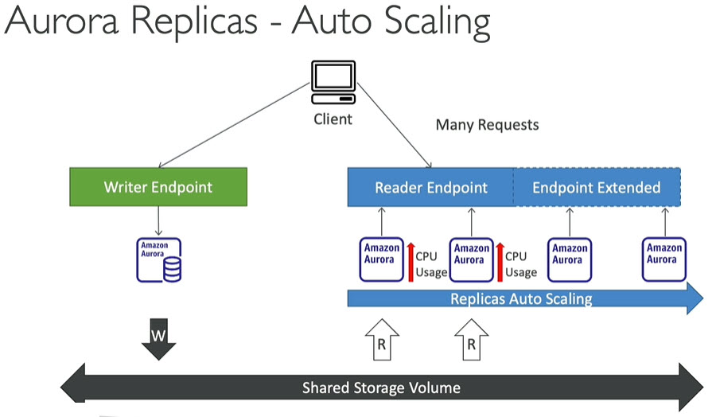

# Aurora Custom Endpoints
* Define subset of aurora instances as customg Endpoints
* Example: In the picture below we have 2 read replicas which are big in size. Because we can define custom endpoints to those replicas and run analytical queries on specific replicas\
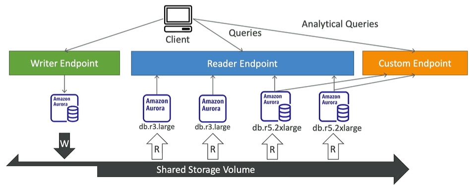

# Serverless
* Automated database instantiation and auto-scaling based on actual usage
* Good for infrequent and unpredictable work loads
* No capacity planning needed
* Pay per second, can be very cost effective\
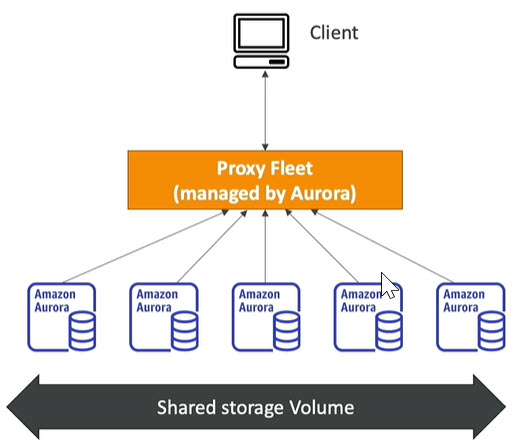

# Global Aurora

# Machine Learning
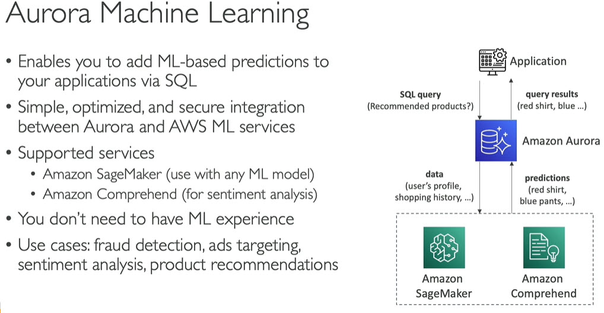

# Database Cloning
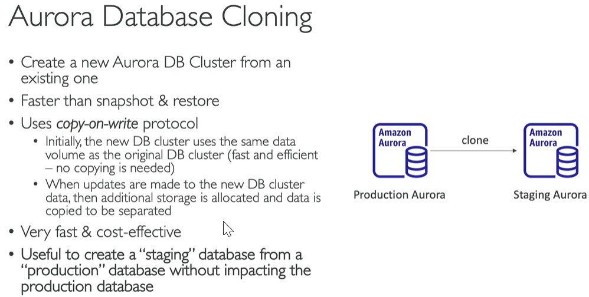
------
# Backup and Monitoring

# RDS Backup
* 

# Aurora Backup
* Automatec backups
	* 1 to 35 days. Cannot be disabled
	* point in time recovery in that timeframe
* Manual DB Snapshots
	* Manually triggered by user
	* Retention of backup for as long as you want

# RDS Aurora restore options

------
# RDS and Aurora security
* At rest encryption
	* Database master and replicas encryption using AWS KMS. Enable encryption must be defined at database launch time
	* If master is not encrypted, then read replicas cannot be encrypted
	* To encrypt un-enrypted database, go through DB snapshot & restore as encrypted
* In-flight encryption: TLS-ready by default, use AWS TLS root certificates client-side
* IAM Authentication: Use IAM roles to connect to your database (instead of username and password)
* Security Groups: Enables network access to your RDS / Aurora DB
* No SSH available except for RDS Custom
* Audit logs can be enabled and sent to CloudWatch logs for longer retention of logs
------
# RDS Proxy
* Fully managed database proxy for RDS
* Allows apps to pool and share DB connections established with the Database
* Improving database efficiency by reducing stress on database (like CPU, RAM) and minimize open connections (and timeouts)
* Serverless, auto scaling, high availability(multi AZ)
* Reduce RDS & Aurora failover time by 66%
* Supports RDS (MySQL, Postgres, MariaDB, SQL Server) and Aurora (MySQL, PostgreSQL)
* No code changes required for most apps
* Enforce IAM Authentication for DB. Securely store credentials in AWS Secrets Manager
* RDS Proxy is never Publicly accessible (must be accessed from VPC)\
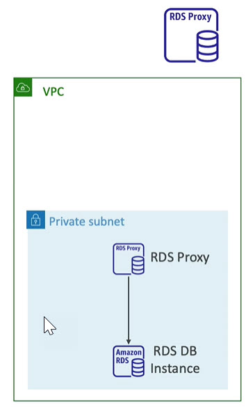
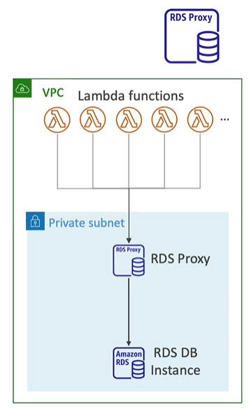
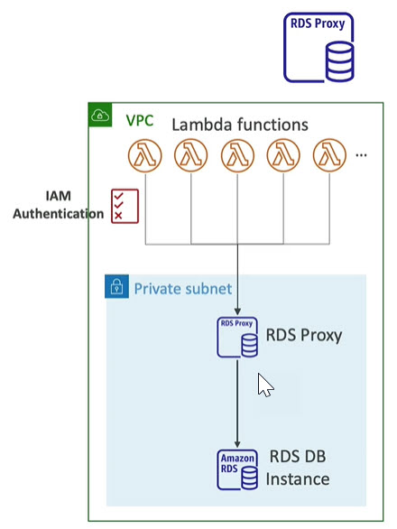
------
# ElastiCache
* Same way RDS get managed Relational Databases, ElastiCache get managed Redis or MemCached
* Caches are in-memory databases with high performance and low latency
* Helps reduce load on databases for read intensive workloads
* Helps make your application stateless
* AWS takes care of OS maintenance/patching, optimization, setup, configuration, monitoring, failure recovery and backups
* `Using ElastiCache involves heavy application code changes`

# ElastiCache solution architecture and DB cache

# ElastiCache solution architecture and user session store
* Make our application stateless by writing user data into amazon elasticache\
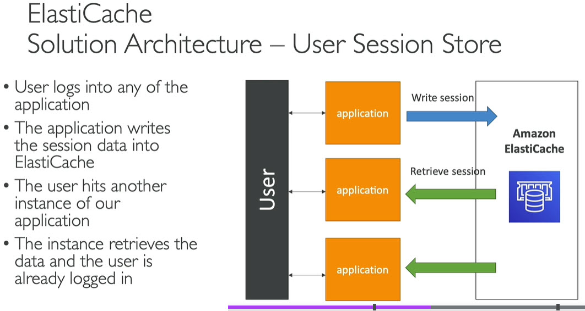

# ElastiCache Redis Vs MemCached
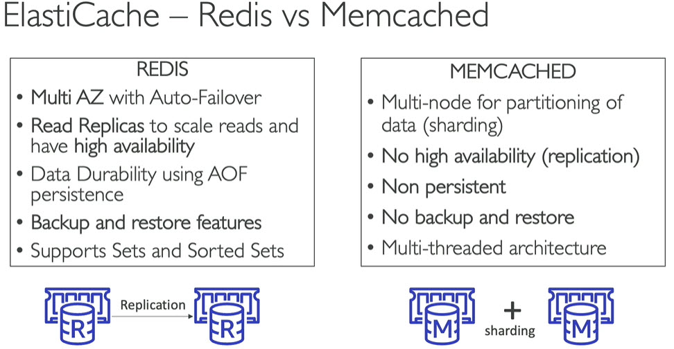

# Cache security
* ElastiCache supports IAM authentication for Redis
* IAM policies on ElastiCache are only used for AWS API-level Security
* Redis AUTH
	* You can create `password/token` when you create Redis cluster
	* This is extra level of security for cache (on top of security groups)
	* Support SSL in flight encryption
* MemCached
	* Supports SASL based Authentication\
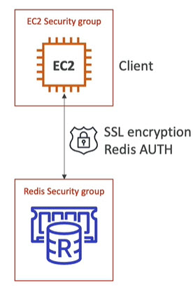

# Patterns of ElastiCache
* Lazy loading: all the read data is cached. Data can become stale in Cache
* Write Through: Adds or update data in cache when written to DB (no stale data)
* Session Store: Store temporary session data in cache (using TTL feature)\
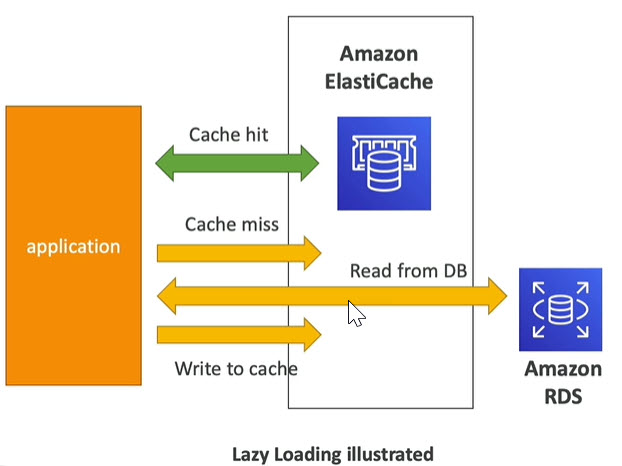

# ElastiCache use case
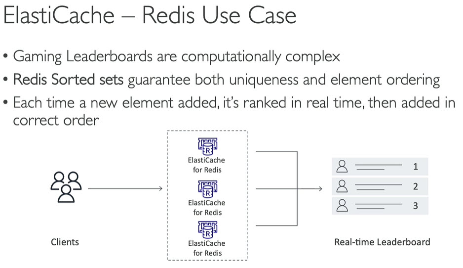