# Use cases
* Backup and Storage
* Disaster Recovery
* Archive
* Hybrid cloud Storage
* Application hosting
* Media hosting
* Data lakes& Big data analytics
* Software delivery
* Static website
------
# buckets
* Allows store objects (files) in `buckets`
* Buckets must have global unique name (across all regions all accounts)
* Buckets are defined at region level
* S3 looks like global service but buckets are created at region level
* Naming convention
	* No uppercase
	* No underscore
	* 3 to 63 characters long
	* Not an IP
	* Must start with lowercase letter or number
	* Must not start with prefix `xn--`
	* Must not end with suffix `-s3alias`
------
# objects

* Object values are content of the body
	* Max object size is 5 TB (5000 GB)
	* If uploading more than 5GB file then must use `multi-part upload`
* Metadata (list of text key / value pairs - system or user metadata)
* Tags (Unicode key / value pair - up to 10) - useful for security / lifecycle
* Version ID (if versioning is enabled)
------
# S3 Simple Storage Service
* Storage on the internet
* HTTP access
* Store and retrieve any amount of data, any time, from any where on the web
* Highly scalable, reliable, fast and durable
* Data will be stored in buckets
* 100 bucket limit per account
* Can store unlimited number of objects in a bucket
* Size of object can be upto 5 TB
* Highly scalable, reliable, fast
* Stores data as `Object` with in bucket
* we can control access to bucket and it's objects
* Have `globally unique bucket names` regardless of AWS region in which they were created
* Object key - unique identifier for an object in bucket - http://doc.s3.amazonaws.com/2022-01-17/myfile.html
	* `doc` - bucket name
	* `2022-01-17/myfile.html` - Object key
------
# Security
* can control access to bucket and objects in the bucket with
	* ACL - Access Control List
	* Bucket policies
	* IAM policies
* Can upload or download data to S3 via SSL encrypted endpoints
* Can encrypt data using AWS SDKs\

------
# S3 Bucket policies

------
# S3 storage classes
* Amazon S3 Standard - Default
	* Frequently used data
* Amazon S3 Standard - Infrequent Access (IA)
	* Long lived less frequently accessed data
	* Used for backups, older data, accessed less but still required high performance
* Amazon S3 One Zone - Infrequent Access
* Amazon S3 Glacier Instant retrieval
* Amazon S3 Glacier Flexible retrieval
* Amazon S3 Glacier Deep Archive
* Glacier
	* Archived data
	* cheaper
	* Not available for real time access
	* Must restore objects before access them
	* when request an object from Glacier, you need to create job that take anywhere between 3-5 hours for the job to complete and object to be available for download
	* Less than $0.01 GB / month (depending on region)\
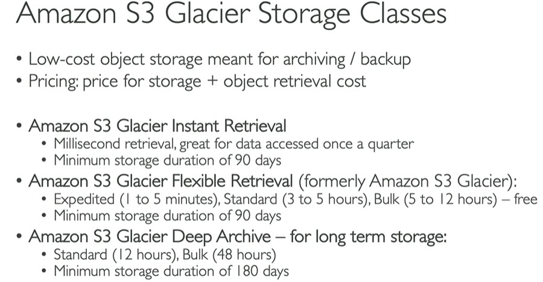
* Amazon S3 Intelligent Tiering\
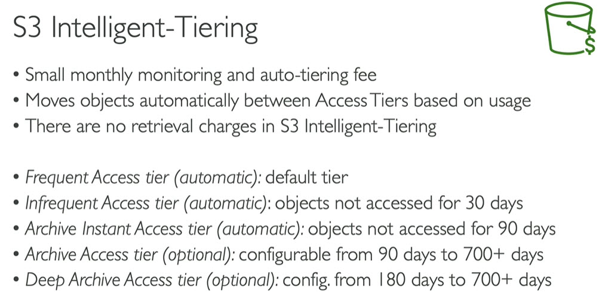
* Storage Classes Comparison\

* Moving between storage classes\
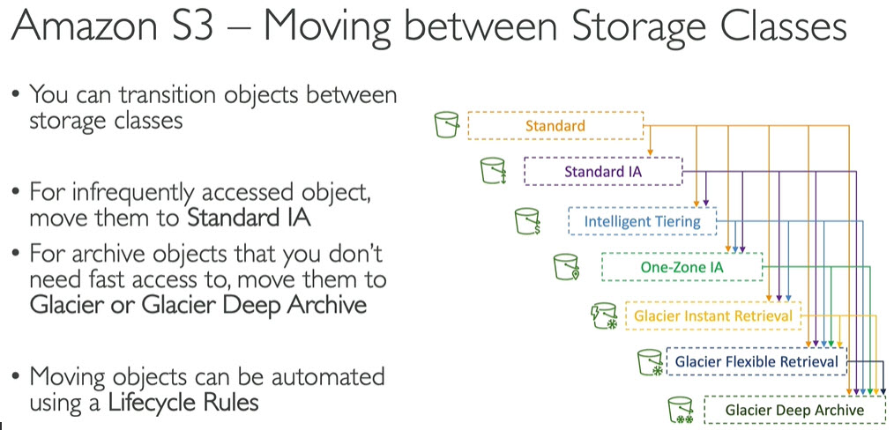
* Life cycle rules\

------
# Pricing
* pay for only what you use
* no minimum fee
* price based on location of amazon s3 bucket
* estimate monthly bill using `AWS Simple Monthly Calculator`
* Pricing is available as
	* Storage pricing
	* Request pricing
	* Data transfer pricing: data transferred out of Amazon S3
------
# Versioning
* protect for accidental overwrites and deletes with no perfomance penalty
* Generates new version with every upload
* Allows easily retrieval of deleted objects or roll back to previous versions
* 3 states of Amazon S3 bucket
	* Un-versioned (default)
	* Versioning enabled
	* Versioning suspended\
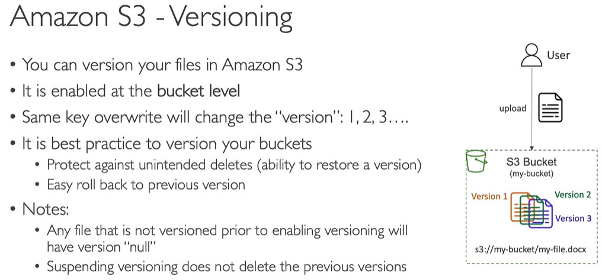
------
# Replication
* CRR - Cross Region Replication
* SRR - Same Region Replication\
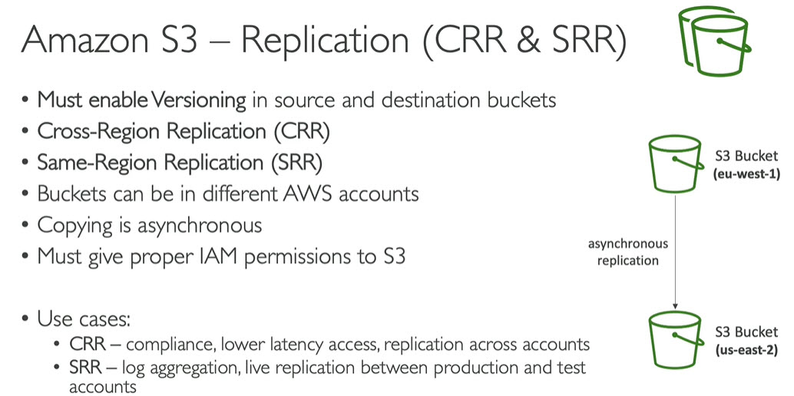
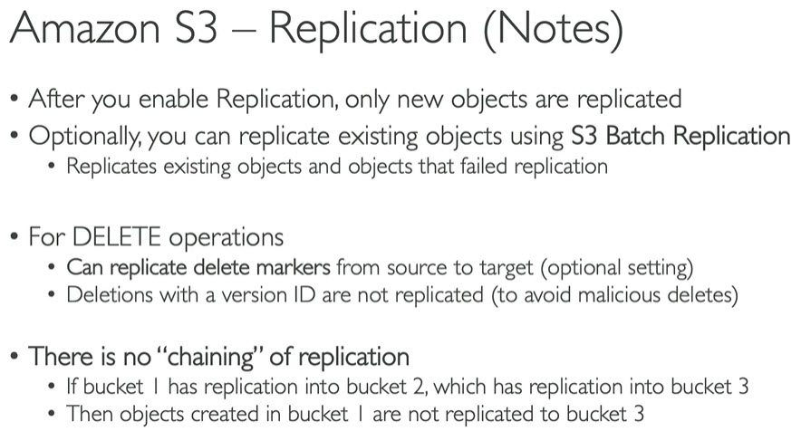
------
# Requester pays
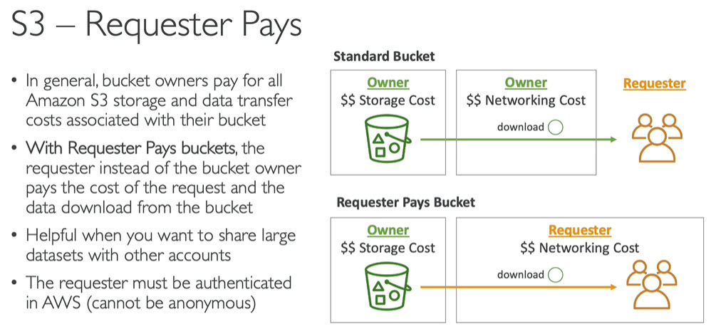
------
# Event Notifications
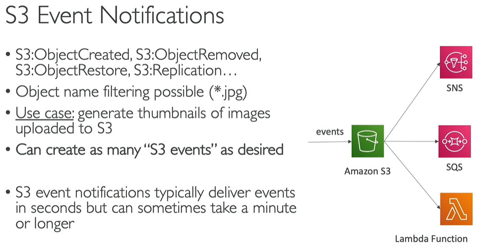
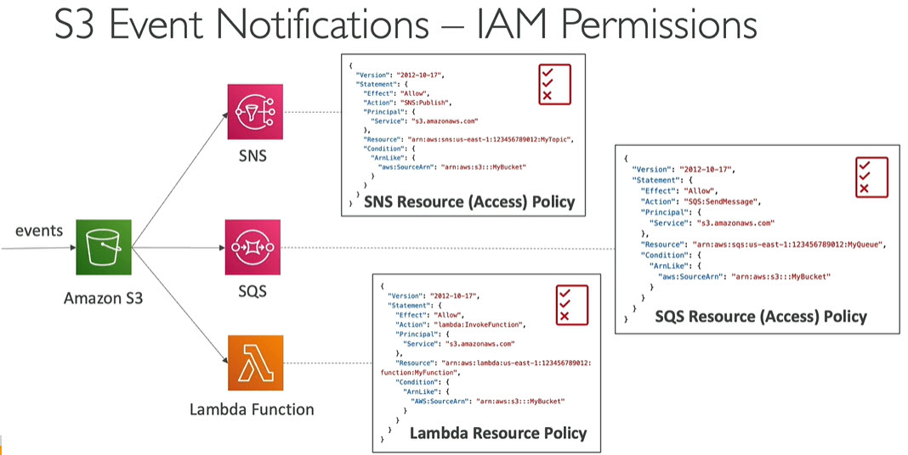
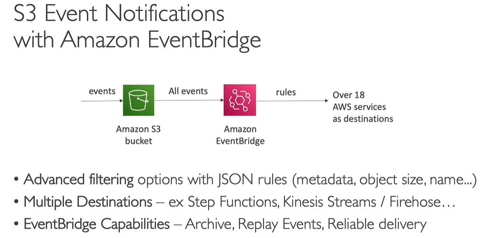
------
# performance
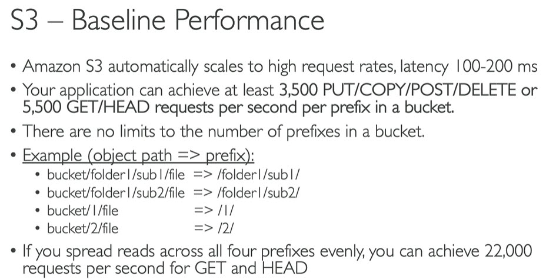

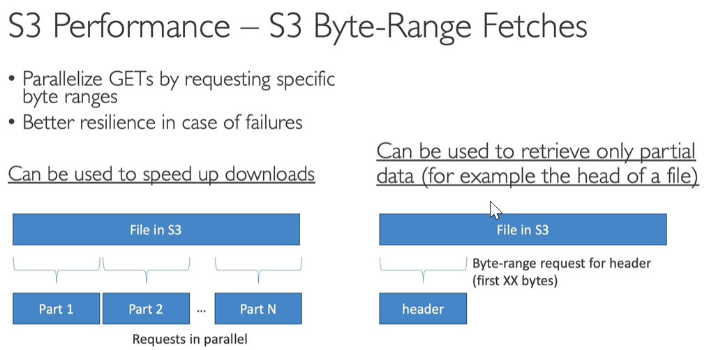
------
# S3 select

------
# Batch operations
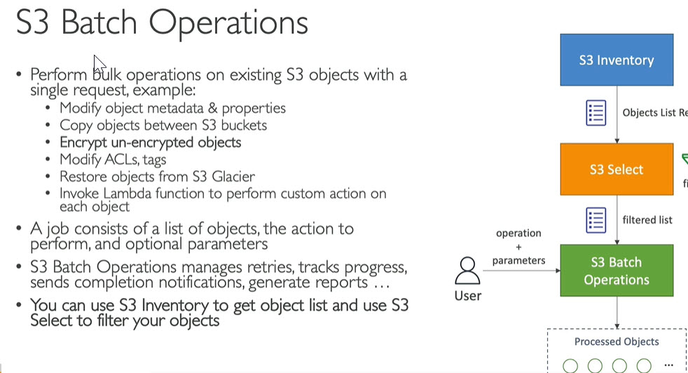
------
# Object encryption

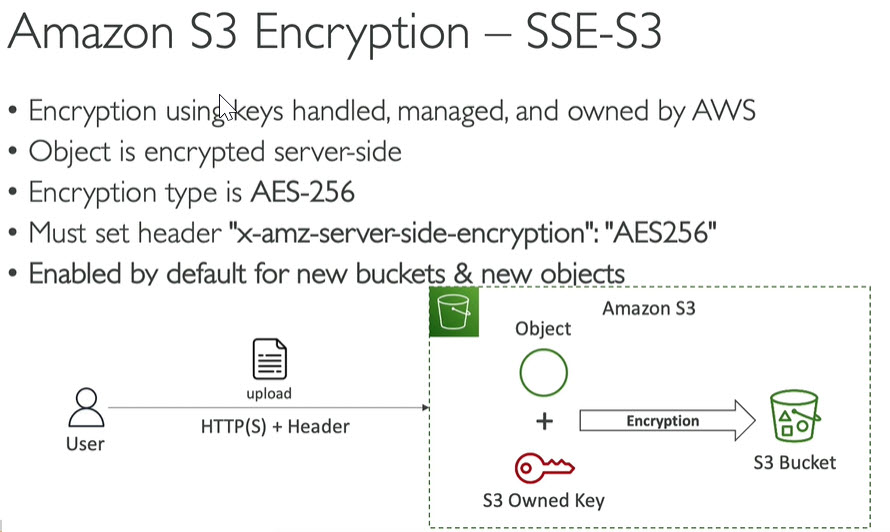


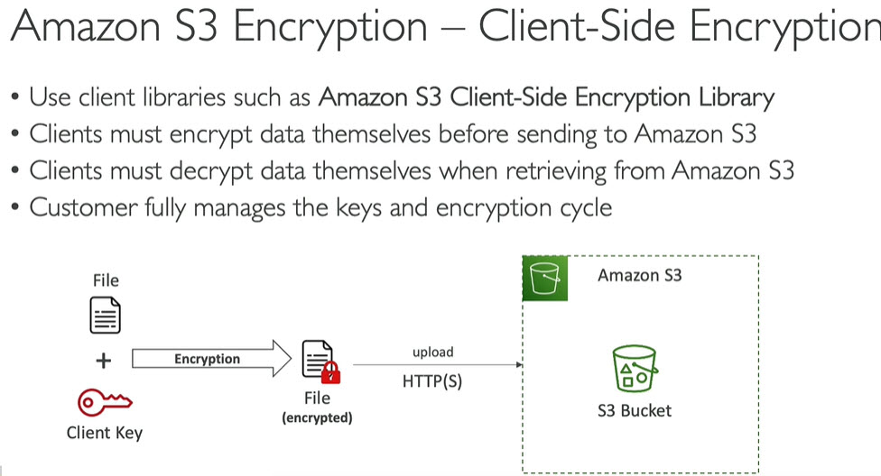
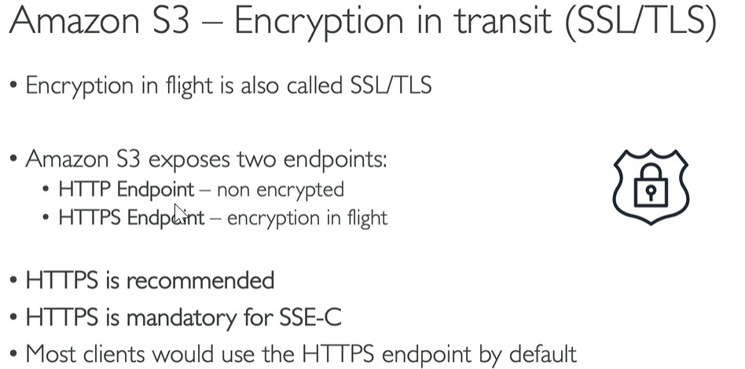


------
# S3 CORS
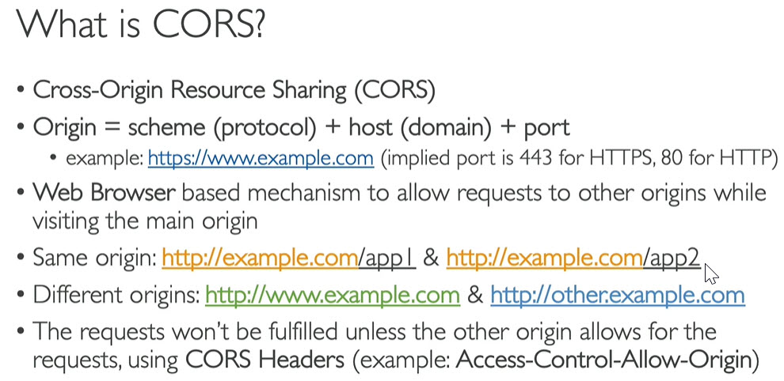

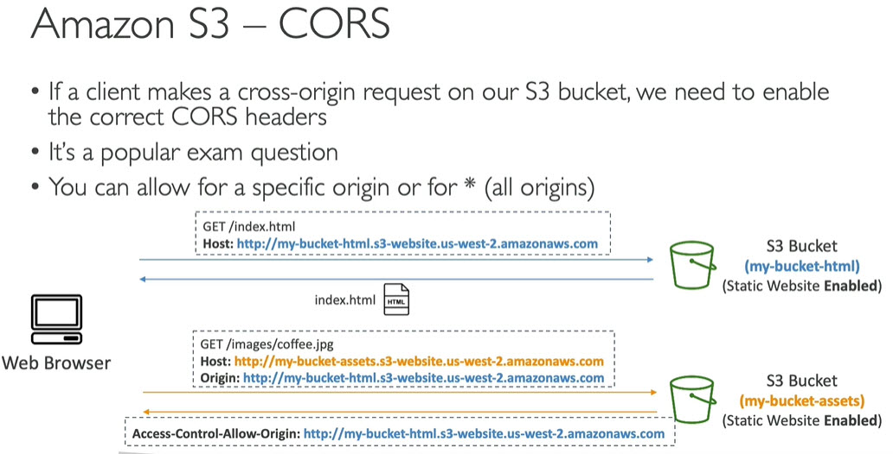
* S3 CORS settings script
```
[
  {
    "AllowedHeaders": [
      "Authorization"
    ],
    "AllowedMethods": [
      "GET"
    ],
    "AllowedOrigins": [
      "url of first bucket with http://...without slash at the end"
    ],
    "ExposeHeaders": [],
    "MaxAgeSeconds": 3000
  }
]
```