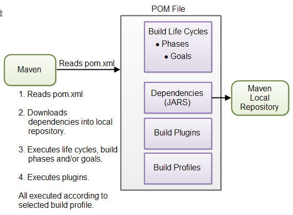
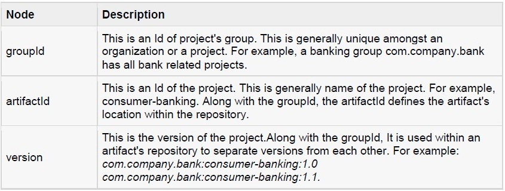
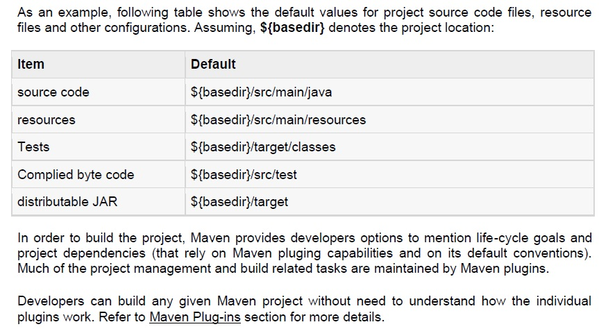
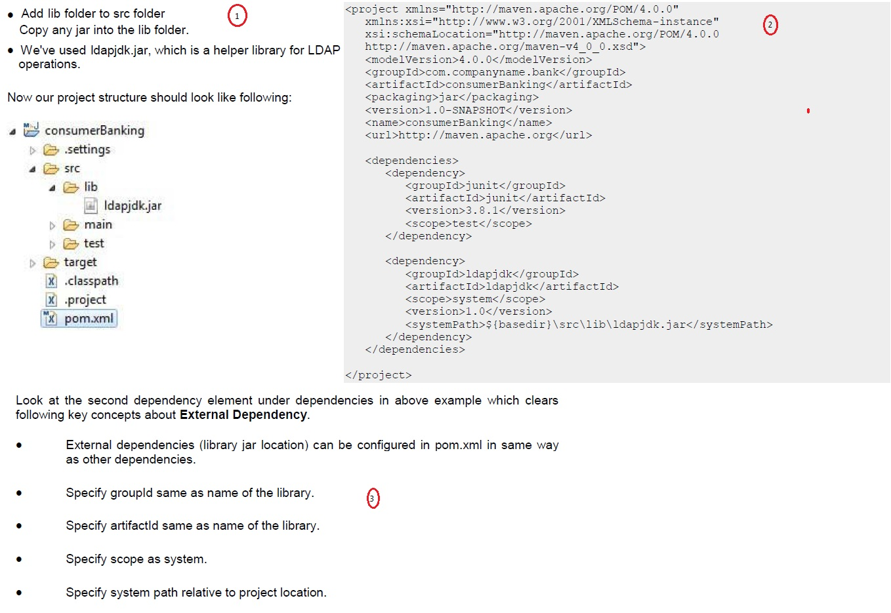
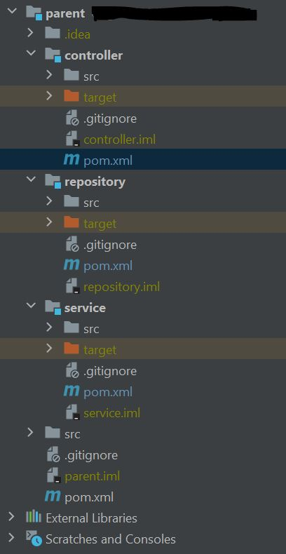

# Maven Notes
------
# Quick Notes
* What is Maven?
	* Build tool to automate the build process
	* Project management and comprehension tool
	* Standardizes and simplifies project build process
* Maven uses standard directory layout and default build life cycle
	* src/main/java
		* java source files means `.java` files
	* src/main/resources
		* project resource files like 
		* properties files
		* yml files
		* xml files
		* any project specific files
	* src/test/java
		* Java test source files
	* src/test/resources
		* resource files used by test classes
* Maven simplifies
	* Builds
	* Documentation
	* Reporting
	* Dependencies
	* Releases
	* Distribution
	* Mailing list
* Maven Overview\

* POM
	* Project Object Model
	* It always resides in the base directory of the project
	* Name of the file `pom.xml`
* Group Id, Artifact Id, Version - Explanation\

* Default values in pom\

* goal or task
	* Specific tasks used in building and managing the project
* some configurations we can give in pom	
	* project dependencies, plugins, goals, build profiles, project versions, mailing list etc
* What uniquely identifies jar/project in maven repository?	
	* group (groupId), name(artifactId), version
* Project notation in repository	
	* groupId:artifactId:version
* pom.xml
	* Maven project structure
	* Contents are declared in pom.xml file
* Build life cycle
	* Sequence of phases which define the order in which the goals are to be executed
* Sequence of phases in maven build life cycle	
	* Prepare-resources
	* compile
	* package
	* install
* Maven uses archetype plugin to create projects
* Maven does the dependency management using concept of Maven Repositories	
* ${basedir}
	* Represents the directory containing pom.xml
* Adding external jars\

* Archetype
	* Archetype is a Maven plugin whose task is to create a project structure as per its template
	* We are going to use quickstart archetype plugin to create a simple java application here
```
mvn archetype:generate
```
* SNAPSHOT
	* SNAPSHOT is a special version that indicates a current development copy. Unlike regular versions, Maven checks for a new SNAPSHOT version in a remote repository for every build
* modelVersion
	* what version of the POM model you are using. Use the one matching the Maven version you are using. Version 4.0.0 matches Maven version 2 and 3
* Super POM
	* You can make a POM file explicitly inherit from another POM file
	* That way you can change the settings across all inheriting POM's via their common super POM
	* You specify the super POM at the top of a POM file
	* An inheriting POM file may override settings from a super POM. Just specify new settings in the inheriting POM file
* Inherting pom
```
<project xmlns="http://maven.apache.org/POM/4.0.0" xmlns:xsi="http://www.w3.org/2001/XMLSchema-instance" 
	xsi:schemaLocation="http://maven.apache.org/POM/4.0.0 http://maven.apache.org/xsd/maven-4.0.0.xsd">
    <modelVersion>4.0.0</modelVersion>
    
	<parent>
		<groupId>org.codehaus.mojo</groupId>
		<artifactId>my-parent</artifactId>
		<version>2.0</version>
		<relativePath>../my-parent</relativePath>
	</parent>
		
	<groupId>com.test</groupId>
	<artifactId>my-project</artifactId>
	<version>1.0.1</version>
</project>
```
* Effective POM
	* With all this POM inheritance it may be hard to know what the total POM file looks like when Maven executes. The total POM file (result of all inheritance) is called the effective POM. You can get Maven to show you the effective POM using this command
	* This command will make Maven write out the effective POM to the command line prompt
```
mvn help:effective-pom
```
* repositories
	* local
	* remote
	* central
* local repository
	* local machine
	* default location	`user-home/.m2`
* remote repository	
	* repository of specific organization
* central repository
	* repository provided by maven
* we can specify another location for your local repository by following entry in `settings.xml`
```
<settings>
    <localRepository>        d:\data\java\products\maven\repository    </localRepository>
</settings>
```
------
# repositories tag
* Remote repository configuration in `pom.xml`. Put the following XML elements right after `<dependencies>` element	
	* If your internal repository requires authentication, the `id` element can be used in your `settings.xml` file to specify login information
```
<repositories>
   <repository>
       <id>jenkov.code</id>
       <url>http://maven.jenkov.com/maven2/lib</url>
	   <releases>
			<enabled>true</enabled>
		</releases>
		<snapshots>
			<enabled>true</enabled>
		</snapshots>
   </repository>
</repositories>
```
* sample repositories tag
```
<repositories>
    <repository>
        <id>spring-snapshot</id>
        <name>Spring Maven Repository</name>
        <url>http://repo.springsource.org/libs-snapshot</url>
        <snapshots>
            <enabled>true</enabled>
        </snapshots>
        <releases>
            <enabled>false</enabled>
        </releases>
    </repository>
</repositories>
```
------
* settings.xml	
	* The repositories for download and deployment are defined by the `repositories` and `distributionManagement` elements of the POM. However, certain settings such as username and password should not be distributed along with the pom.xml. This type of information should exist on the build server in the settings.xml
* servers tag
	* id: This is the ID of the server (not of the user to login as) that matches the id element of the repository/mirror that Maven tries to connect to
	* username, password: These elements appear as a pair denoting the login and password required to authenticate to this server
	* privateKey, passphrase: Like the previous two elements, this pair specifies a path to a private key (default is ${user.home}/.ssh/id_dsa) and a passphrase, if required. The passphrase and password elements may be externalized in the future, but for now they must be set plain-text in the settings.xml file.
	* filePermissions, directoryPermissions: When a repository file or directory is created on deployment, these are the permissions to use. The legal  values of each is a three digit number corrosponding to *nix file permissions, ie. 664, or 775.
	* Note: If you use a private key to login to the server, make sure you omit the `<password>` element. Otherwise, the key will be ignored.
```
<servers>
	<server>
	  <id>server001</id>
	  <username>my_login</username>
	  <password>my_password</password>
	  <privateKey>${user.home}/.ssh/id_dsa</privateKey>
	  <passphrase>some_passphrase</passphrase>
	  <filePermissions>664</filePermissions>
	  <directoryPermissions>775</directoryPermissions>
	  <configuration></configuration>
	</server>
</servers>
```
* Transitive dependencies	
	* If we add one dependency in pom.xml and if that dependency has other dependencies then maven will download automatically all the dependent dependencies. These dependent dependencies are called Transitive dependencies.
* Goals 	
	* clean
	* compile
	* package
	* install
	* deploy
* clean	
	* Deletes target directory and any generated resources
* compile (this is goal, do not confuse with compile scope)	
	* compiles source code
	* copy resources to classes directory
* package	
	* run compile goal first
	* run unit test cases
	* packages the application based on packaging type we declared in `pom.xml`
* install	
	* Runs package goal
	* copies generated package into `local repository` based on groupId, artifactId, version declared in pom.xml
* deploy
	* Runs install goal
	* copies generated package into `remote repository`
* How to give specific name to our application jar/war	
	* using `<finalName>MavenHelloWorld</finalName>` tag in `<build>` tag
	* Now our war name will be MavenHelloWorld.war
```
<finalName>MavenHelloWorld</finalName>

<finalName>{project.artifactId}</finalName>
```
* Dependency types	
	* pom, jar, maven-plugin, ear, war, rar, par
	* default packaging type is jar
* pom dependency type	
	* If we declare dependency type as pom then all dependencies in that pom will be downloaded to our application
* plugin repositories - for downloading plugins	
```
<pluginRepositories>
    <pluginRepository>
        <id>cerebro corp</id>
        <name>Cerebro plugin repository</name>
        <url>http://cerebrocorp.com/plugins</url>
        <snapshots>
            <enabled>true</enabled>
        </snapshots>
        <releases>
            <enabled>false</enabled>
        </releases>
    </pluginRepository>
</pluginRepositories>
```
* Maven plugins	
	* Plugins are what maven uses to build and package our application as well as do anything outside of just downloading and storing artifacts for us
	* compiler plugin	
```	
<plugin>
	<groupId>org.apache.maven.plugins</groupId>
	<artifactId>maven-compiler-plugin</artifactId>
	<version>3.5.1</version>
	<configuration>
		<source>1.8</source>
		<target>1.8</target>
		<showDeprecation>true</showDeprecation>
		<showWarnings>1.8</showWarnings>
		<compilerArgument>-Xlint:all</compilerArgument>
		<compilerArgument>-parameters</compilerArgument>
	</configuration>
</plugin>
```	
	* jar plugin	
	* sources plugin	
	* javadoc plugin	
* Some built in phases	
	* validate
	* compile
	* test
	* package
	* integration-test
	* verify
	* install
	* deploy
* validate
	* validates the project is correct and has all the necessary information is available
	* This also makes sure the dependencies are downloaded.
* compile
	* phase where our source code is compiled. Here test code will not compile
* test
	* phase where test code is compiled. Executes test cases
* package
	* packages all our code into it's defined packaging such as jars
* integration-test
	* deploy and run integration test
* source plugin	
	* to attache our source code to jar
* run mvn by passing aws.access key and secret key as java parameters	
	* mvn -Daws.accessKeyId=XYZ -Daws.secretKey=ABC clean compile install
	* http://docs.aws.amazon.com/sdk-for-java/v1/developer-guide/credentials.html

* built in build life cycles
	* default
	* clean
	* site
* default	
	* everything related to compiling and packaging your project
* clean
	* everything related to removing temporary files from the output directory, including generated source files, compiled classes, previous JAR files etc
* site
	* everything related to generating documentation for your project. In fact, site can generate a complete website with documentation for your   project
* compile
	* Compiles the source code of the project.
* test
	* Runs the tests against the compiled source code using a suitable unit testing framework. These tests should not require the code be packaged or deployed.
* package
	* Packs the compiled code in its distributable format, such as a JAR.
* integration-test
	* process and deploy the package if necessary into an environment where integration tests can be run
* verify
	* run any checks to verify the package is valid and meets quality criteria
* install
	* Install the package into the local repository to use as dependency in other projects locally. This is part of default build life cycle
* deploy
	* Copies the final package to the remote repository for sharing with other developers and projects.
* Maven Build Profiles
	* Maven build profiles enable you to build your project using different configurations
	* Instead of creating two separate POM files, you can just specify a profile with the different build configuration, and build your project with this build profile when needed
```
<profiles>
<profile>
  <id>test</id>
  <activation>...</activation>
  <build>...</build>
  <modules>...</modules>
  <repositories>...</repositories>
  <pluginRepositories>...</pluginRepositories>
  <dependencies>...</dependencies>
  <reporting>...</reporting>
  <dependencyManagement>...</dependencyManagement>
  <distributionManagement>...</distributionManagement>
</profile>
</profiles>
```
* activation
	* Inside the profile element you can see a activation element. This element describes the condition that triggers this build profile to be used
	* way 1: One way to choose what profile is being executed is in the settings.xml file. There you can set the active profile. `<activeProfiles> <activeProfile>test</activeProfile> </activeProfiles>`
	* way 2: Another way is to add -P profile-name to the Maven command line.
	* To see which profile will activate in a certain build, use the maven-help-plugin: `mvn help:active-profiles`
* How to get effective pom into a text file	
```
mvn help:effective-pom > c:\poms\test.txt
```
* Executing main class from maven command prompt
```
mvn exec:java -Dexec.mainClass=com.camel.spring.CamelSpringHelloWorld
```
------
# maven-install-plugin
* Maven install plugin to install any jar automatically before building our war/jar
```
 <plugin>
<groupId>org.apache.maven.plugins</groupId>
<artifactId>maven-install-plugin</artifactId>
<version>2.5.2</version>
<executions>
	<execution>
		<id>whatevs</id>
		<phase>validate</phase>
		<goals>
			<goal>install-file</goal>
		</goals>
		<configuration>
			<groupId>com.oracle</groupId>
			<artifactId>ojdbc6</artifactId>
			<version>${oracle.version}</version>
			<packaging>jar</packaging>
			<file>${basedir}/dev-setup/lib/ojdbc6.jar</file>
		</configuration>
	</execution>
</executions>
</plugin>
```
------
* Runnning test cases using maven
```
mvn -f dashboard/domain/pom.xml -Dtest=DomainTestsSuite test
```
* parameters
	* To preserve method parameter names in Java byte-code and make them available at runtime
```
<plugin>
	<groupId>org.apache.maven.plugins</groupId>
	<artifactId>maven-compiler-plugin</artifactId> 
	<version>3.5.1</version>
	<configuration>
		<compilerArgument>-parameters</compilerArgument>
		<source>1.8</source>
		<target>1.8</target>
	</configuration>
</plugin>
```
* create encrypted password that can go to settings.xml
	* mvn --encrypt-passord
		* From maven 3.2.1 and above - running above command will prompt for password. After entering password encrypted password will be created.
```
<servers>
	<id>my.server</id>
	<username>myusername</username>
	<password>{encrypted_password}</password>
</servers>
```
------
# maven-war-plugin
* In Spring boot applications we will not have web.xml then in pom.xml if we are adding maven-web-plugin then this will complain like web.xml is missing. To resolve this error we need to add <failOnMissingWebXml> tag value to false
```
<build>
<finalName>merchantinteractivepayments</finalName>
<plugins>
	<plugin>
		<groupId>org.apache.maven.plugins</groupId>
		<artifactId>maven-war-plugin</artifactId>
		<configuration>
			<failOnMissingWebXml>false</failOnMissingWebXml>
		</configuration>
	</plugin>
</plugins>
</build>
```
------
# exec-maven-plugin
* How to run `exec:java` to execute main class using maven command
	* mvn exec:java
```
<plugin>
<groupId>org.codehaus.mojo</groupId>
<artifactId>exec-maven-plugin</artifactId>
<configuration>
	 <mainClass>com.hmkcode.MainClassName</mainClass>
</configuration>
</plugin>
```
------
# distributionManagement tag
* To push to remote repository
```
<distributionManagement>
    <repository>
      <id>operative-releases</id>
      <name>Operative Releases Repository</name>
      <url>${operative.nexus}/repositories/operative-releases</url>
    </repository>
    <snapshotRepository>
      <id>operative-snapshots</id>
      <name>Operative Snapshots Repository</name>
      <url>${operative.nexus}/repositories/operative-snapshots</url>
    </snapshotRepository>
    <site>
      <id>operative-mavensite</id>
      <name>Operative Maven WebSite</name>
      <url>operative-global</url>
    </site>
  </distributionManagement>
```
------
# Maven Spring Boot Plugin
```
<plugin>
	<groupId>org.springframework.boot</groupId>
	<artifactId>spring-boot-maven-plugin</artifactId>
</plugin>
```
------
## Maven Execute Exec Plugin
* Add `exec-maven-plugin` plugin under `build/plugins` in `pom.xml`
* Configure full packaged class name of main class in the plugin
* Execute main program using command: `mvn exec:java`
```
<plugin>
	<groupId>org.codehaus.mojo</groupId>
	<artifactId>exec-maven-plugin</artifactId>
	<version>1.6.0</version>
	<configuration>
	  <mainClass>com.test.MainAppClassName</mainClass>
	  <executable>java</executable>
	  <arguments>
		<argument>-Xms1024M</argument>
		<argument>-Xmx1024M</argument>
		<argument>-cp</argument>
		<classpath/>
	  </arguments>
	</configuration>
 </plugin>
```
------
# Maven compile plugin
* For Java 8
```
<plugin>
	<groupId>org.apache.maven.plugins</groupId>
	<artifactId>maven-compiler-plugin</artifactId>
	<version>3.8.1</version>
	<configuration>
		<source>1.8</source>
		<target>1.8</target>
		<meminitial>128m</meminitial>
		<maxmem>512m</maxmem>
		<showDeprecation>true</showDeprecation>
		<showWarnings>true</showWarnings>
		<encoding>UTF-8</encoding>
		<verbose>true</verbose>
		<compilerArgument>-Xlint:all</compilerArgument>
		<compilerArgument>-parameters</compilerArgument>
	</configuration>
</plugin>
```
* For Java 9
```
<plugin>
	<groupId>org.apache.maven.plugins</groupId>
	<artifactId>maven-compiler-plugin</artifactId>
	<version>3.8.1</version>
	<configuration>
		<release>9</release>
	</configuration>
</plugin>
```
* For Java 11. Reference - [https://winterbe.com/posts/2018/08/29/migrate-maven-projects-to-java-11-jigsaw/](https://winterbe.com/posts/2018/08/29/migrate-maven-projects-to-java-11-jigsaw/)
* In order to compile your project for Java 11 add the `release` configuration to the compiler plugin
* New compiler parameter to replace the `source` and `target` version parameters
* Don't forget to set your IDEs project SDK to same JDK version
```
<plugin>
	<groupId>org.apache.maven.plugins</groupId>
	<artifactId>maven-compiler-plugin</artifactId>
	<version>3.8.1</version>
	<configuration>
		<release>11</release>
	</configuration>
</plugin>
```
* Java 12
```
<build>
    <plugins>
        <plugin>
            <groupId>org.apache.maven.plugins</groupId>
            <artifactId>maven-compiler-plugin</artifactId>
            <version>3.8.0</version>
            <configuration>
                <source>12</source>
                <compilerArgs>--enable-preview</compilerArgs>
            </configuration>
        </plugin>
    </plugins>
</build>	
```
------
# Maven Surefire Plugin
* Java 11 - surefire plugin we add an additional argument `--illegal-access=permit` to allow all reflection access for third party libraries
```
<plugin>
    <groupId>org.apache.maven.plugins</groupId>
    <artifactId>maven-surefire-plugin</artifactId>
    <version>2.22.0</version>
    <configuration>
        <argLine>
            --illegal-access=permit
        </argLine>
    </configuration>
</plugin>
```
* This is only needed if your dependencies make heavy use of reflection. If you're unsure whether you need this you can add the `argLine` later if your tests run into trouble.
* You'll see warnings like this when a library tries to illegally access classes via setAccessible(true)
```
WARNING: Please consider reporting this to the maintainers of org.codehaus.groovy.reflection.CachedClass
WARNING: Use --illegal-access=warn to enable warnings of further illegal reflective access operations
WARNING: All illegal access operations will be denied in a future release
```
------
# maven-failsafe-plugin
* Java 11 - failsafe plugins we add an additional argument `--illegal-access=permit` to allow all reflection access for third party libraries
```
<plugin>
    <groupId>org.apache.maven.plugins</groupId>
    <artifactId>maven-failsafe-plugin</artifactId>
    <version>2.22.0</version>
    <configuration>
        <argLine>
            --illegal-access=permit
        </argLine>
    </configuration>
</plugin>
```
------
# Skip Test Cases
* To skip running the tests for a particular project, set the skipTests property to true
```
<project>
  [...]
  <build>
    <plugins>
      <plugin>
        <groupId>org.apache.maven.plugins</groupId>
        <artifactId>maven-surefire-plugin</artifactId>
        <version>2.19.1</version>
        <configuration>
          <skipTests>true</skipTests>
        </configuration>
      </plugin>
    </plugins>
  </build>
  [...]
</project>
```
* skip the tests via the command line by executing the following command
```
mvn install -DskipTests
```
* can also use the maven.test.skip property to skip compiling the tests. maven.test.skip is honored by Surefire, Failsafe and the Compiler Plugin
```
mvn install -Dmaven.test.skip=true
```
* Skipping by Default - If you want to skip tests by default but want
 the ability to re-enable tests from the command line, you need to go via a properties section in the pom
	* This will allow you to run with tests disabled by default and to run them with this command `mvn install -DskipTests=false`

```
<project>
  [...]
  <properties>
    <skipTests>true</skipTests>
  </properties>
  [...]
  <build>
    <plugins>
      <plugin>
        <groupId>org.apache.maven.plugins</groupId>
        <artifactId>maven-surefire-plugin</artifactId>
        <version>2.19.1</version>
        <configuration>
          <skipTests>${skipTests}</skipTests>
        </configuration>
      </plugin>
    </plugins>
  </build>
  [...]
</project>
```
------
# Maven version plugin
* This plugin helps finding the latest plugin or dependency versions for your modules
```
<plugin>
    <groupId>org.codehaus.mojo</groupId>
    <artifactId>versions-maven-plugin</artifactId>
    <version>2.5</version>
    <configuration>
        <generateBackupPoms>false</generateBackupPoms>
    </configuration>
</plugin>
```
* Open up the terminal and execute this command to find the plugin versions you have to update
```
mvn versions:display-plugin-updates
```
* You will see a list of plugins used in your project with newer versions available. Update all of those plugins to the lastest stable version. After you've updated your plugin versions make sure that your project still compiles and runs properly
* Use mvn -N ... from your projects root directory to just check your parent POM in case of multi-module projects.
------
# Build scan
* https://scans.gradle.com/?_ga=2.176353708.821953821.1675911397-2076437657.1675676943#maven
------
# Maven multi module project
* A multi-module project is built from an aggregator POM that manages a group of submodules. In most cases, the aggregator is located in the project's root directory and must have packaging of type pom.
* The submodules are regular Maven projects, and they can be built separately or through the aggregator POM.
* By building the project through the aggregator POM, each project that has a packaging type different from pom will result in a built archive file
## Benefits of Using Multi-Modules
* The significant advantage of using this approach is that we may reduce duplication
* Let's say we have an application that consists of several modules, a front-end module and a back-end module. Now imagine we work on them and change the functionality, which affects them both. In that case, without a specialized build tool, we'd have to build both components separately or write a script to compile the code, run tests, and show the results. Then, after we got even more modules in the project, it would become harder to manage and maintain.
* In the real world, projects may need certain Maven plugins to perform various operations during the build lifecycle, to share dependencies and profiles, and to include other BOM projects.
* Therefore, when leveraging multi-modules, we can build our application's modules in a single command, and if the order matters, Maven will figure it out for us. We can also share a vast amount of configuration with other modules
## Parent POM
* Maven supports inheritance in a way that each pom.xml file has the implicit parent POM. It's called Super POM and can be located in the Maven binaries. These two files are merged by Maven and form the Effective POM
* We can create our own pom.xml file, which will serve us as the parent project. Then we can include in it all configuration with dependencies, and set it as the parent of our child modules, so they'll inherit from it.
* Besides the inheritance, Maven provides the notion of aggregation. A parent POM that leverages this functionality is called an aggregate POM. Basically, this kind of POM declares its modules explicitly in its pom.xml file.

## Submodules
* Submodules, or subprojects, are regular Maven projects that inherit from the parent POM. As we already know, inheritance lets us share the configuration and dependencies with submodules. However, if we'd like to build or release our project in one shot, we have to declare our submodules explicitly in the parent POM. Ultimately, our parent POM will be the parent, as well as the aggregate POM.

## Building the Application
* Now that we understand Maven's submodules and hierarchy, let's build a sample application to demonstrate them. We'll use Maven's command-line interface to generate our projects
* Create parent project
```
mvn archetype:generate -DgroupId=com.java.maven -DartifactId=parent -Dversion=1.0.0 -DarchetypeArtifactId=maven-archetype-quickstart -DinteractiveMode=false
```
* Open `pom.xml` in parent. Change `<packaging>` to `pom`
```
<packaging>pom</packaging>
```
* Create sub module. Navigate indide to `parent`, execute following commands
```
mvn archetype:generate -DgroupId=com.java.maven -DartifactId=controller -Dversion=1.0.0 -DarchetypeArtifactId=maven-archetype-quickstart -DinteractiveMode=false

mvn archetype:generate -DgroupId=com.java.maven -DartifactId=service -Dversion=1.0.0 -DarchetypeArtifactId=maven-archetype-quickstart -DinteractiveMode=false

mvn archetype:generate -DgroupId=com.java.maven -DartifactId=repository -Dversion=1.0.0 -DarchetypeArtifactId=maven-archetype-quickstart -DinteractiveMode=false
```
* In parent `pom.xml` we can see `<modules>` tag added with list of sub modules
```
<modules>
	<module>controller</module>
	<module>service</module>
	<module>repository</module>
</modules>
```
* In each sub module `pom.xml` we can see `<parent>` tag
```
<parent>
	<groupId>com.java.maven</groupId>
	<artifactId>parent</artifactId>
	<version>1.0.0</version>
</parent>
```
## Building the Project
* Execute below command from parent folder. This will package all sub modules
```
mvn package
```
* `package` command result
```

C:\parent>mvn package
[INFO] Scanning for projects...
[INFO] ------------------------------------------------------------------------
[INFO] Reactor Build Order:
[INFO]
[INFO] parent                                                             [pom]
[INFO] controller                                                         [jar]
[INFO] service                                                            [jar]
[INFO] repository                                                         [jar]
[INFO]
[INFO] -----------------------< com.java.maven:parent >------------------------
[INFO] Building parent 1.0.0                                              [1/4]
[INFO] --------------------------------[ pom ]---------------------------------
[INFO]
[INFO] ---------------------< com.java.maven:controller >----------------------
[INFO] Building controller 1.0.0                                          [2/4]
[INFO] --------------------------------[ jar ]---------------------------------
[INFO]
[INFO] --- maven-resources-plugin:2.6:resources (default-resources) @ controller ---
[WARNING] Using platform encoding (Cp1252 actually) to copy filtered resources, i.e. build is platform dependent!
[INFO] skip non existing resourceDirectory C:\github\java\maven\parent\controller\src\main\resources
[INFO]
[INFO] --- maven-compiler-plugin:3.1:compile (default-compile) @ controller ---
[INFO] Nothing to compile - all classes are up to date
[INFO]
[INFO] --- maven-resources-plugin:2.6:testResources (default-testResources) @ controller ---
[WARNING] Using platform encoding (Cp1252 actually) to copy filtered resources, i.e. build is platform dependent!
[INFO] skip non existing resourceDirectory C:\github\java\maven\parent\controller\src\test\resources
[INFO]
[INFO] --- maven-compiler-plugin:3.1:testCompile (default-testCompile) @ controller ---
[INFO] Nothing to compile - all classes are up to date
[INFO]
[INFO] --- maven-surefire-plugin:2.12.4:test (default-test) @ controller ---
[INFO] Surefire report directory: C:\github\java\maven\parent\controller\target\surefire-reports

-------------------------------------------------------
 T E S T S
-------------------------------------------------------
Running com.java.maven.AppTest
Tests run: 1, Failures: 0, Errors: 0, Skipped: 0, Time elapsed: 0.005 sec

Results :

Tests run: 1, Failures: 0, Errors: 0, Skipped: 0

[INFO]
[INFO] --- maven-jar-plugin:2.4:jar (default-jar) @ controller ---
[INFO]
[INFO] -----------------------< com.java.maven:service >-----------------------
[INFO] Building service 1.0.0                                             [3/4]
[INFO] --------------------------------[ jar ]---------------------------------
[INFO]
[INFO] --- maven-resources-plugin:2.6:resources (default-resources) @ service ---
[WARNING] Using platform encoding (Cp1252 actually) to copy filtered resources, i.e. build is platform dependent!
[INFO] skip non existing resourceDirectory C:\github\java\maven\parent\service\src\main\resources
[INFO]
[INFO] --- maven-compiler-plugin:3.1:compile (default-compile) @ service ---
[INFO] Nothing to compile - all classes are up to date
[INFO]
[INFO] --- maven-resources-plugin:2.6:testResources (default-testResources) @ service ---
[WARNING] Using platform encoding (Cp1252 actually) to copy filtered resources, i.e. build is platform dependent!
[INFO] skip non existing resourceDirectory C:\github\java\maven\parent\service\src\test\resources
[INFO]
[INFO] --- maven-compiler-plugin:3.1:testCompile (default-testCompile) @ service ---
[INFO] Nothing to compile - all classes are up to date
[INFO]
[INFO] --- maven-surefire-plugin:2.12.4:test (default-test) @ service ---
[INFO] Surefire report directory: C:\github\java\maven\parent\service\target\surefire-reports

-------------------------------------------------------
 T E S T S
-------------------------------------------------------
Running com.java.maven.AppTest
Tests run: 1, Failures: 0, Errors: 0, Skipped: 0, Time elapsed: 0.013 sec

Results :

Tests run: 1, Failures: 0, Errors: 0, Skipped: 0

[INFO]
[INFO] --- maven-jar-plugin:2.4:jar (default-jar) @ service ---
[INFO]
[INFO] ---------------------< com.java.maven:repository >----------------------
[INFO] Building repository 1.0.0                                          [4/4]
[INFO] --------------------------------[ jar ]---------------------------------
[INFO]
[INFO] --- maven-resources-plugin:2.6:resources (default-resources) @ repository ---
[WARNING] Using platform encoding (Cp1252 actually) to copy filtered resources, i.e. build is platform dependent!
[INFO] skip non existing resourceDirectory C:\github\java\maven\parent\repository\src\main\resources
[INFO]
[INFO] --- maven-compiler-plugin:3.1:compile (default-compile) @ repository ---
[INFO] Nothing to compile - all classes are up to date
[INFO]
[INFO] --- maven-resources-plugin:2.6:testResources (default-testResources) @ repository ---
[WARNING] Using platform encoding (Cp1252 actually) to copy filtered resources, i.e. build is platform dependent!
[INFO] skip non existing resourceDirectory C:\github\java\maven\parent\repository\src\test\resources
[INFO]
[INFO] --- maven-compiler-plugin:3.1:testCompile (default-testCompile) @ repository ---
[INFO] Nothing to compile - all classes are up to date
[INFO]
[INFO] --- maven-surefire-plugin:2.12.4:test (default-test) @ repository ---
[INFO] Surefire report directory: C:\github\java\maven\parent\repository\target\surefire-reports

-------------------------------------------------------
 T E S T S
-------------------------------------------------------
Running com.java.maven.AppTest
Tests run: 1, Failures: 0, Errors: 0, Skipped: 0, Time elapsed: 0.009 sec

Results :

Tests run: 1, Failures: 0, Errors: 0, Skipped: 0

[INFO]
[INFO] --- maven-jar-plugin:2.4:jar (default-jar) @ repository ---
[INFO] ------------------------------------------------------------------------
[INFO] Reactor Summary for parent 1.0.0:
[INFO]
[INFO] parent ............................................. SUCCESS [  0.003 s]
[INFO] controller ......................................... SUCCESS [  1.449 s]
[INFO] service ............................................ SUCCESS [  0.559 s]
[INFO] repository ......................................... SUCCESS [  0.381 s]
[INFO] ------------------------------------------------------------------------
[INFO] BUILD SUCCESS
[INFO] ------------------------------------------------------------------------
[INFO] Total time:  2.494 s
[INFO] Finished at: 2023-02-19T07:27:41+05:30
[INFO] ------------------------------------------------------------------------
```
# Import
* Import to IDE. IntelliJ in below screen\
