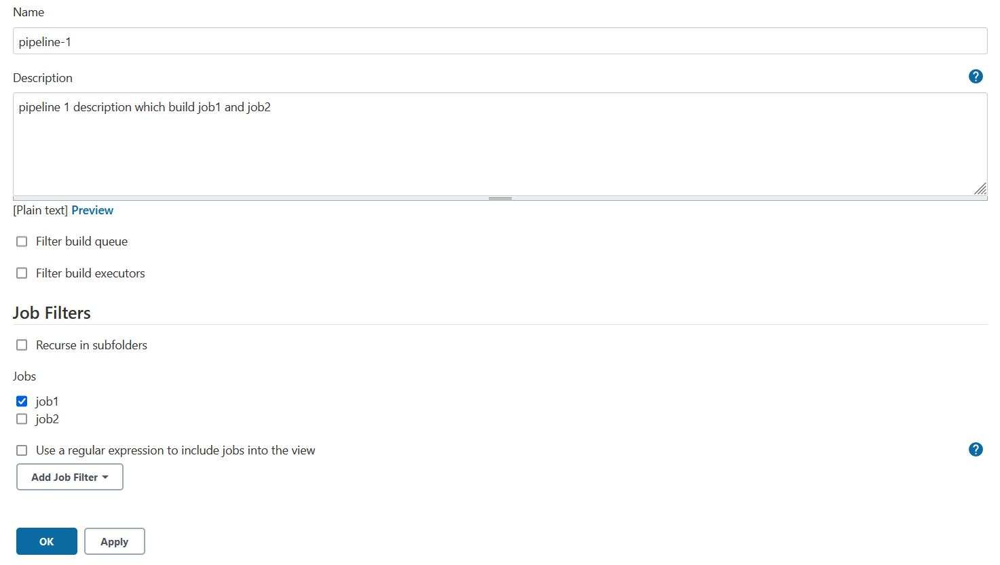

# Chain multiple job using pipeline
* Create 2 jobs
	* job1
	* job2
* Configure job1 to trigger job2 after completion. Do this using job1 `Post-build Actions`\

* Create pipeline. Click `+` symbol\

* Give View name. Select `List View`. Click `OK`\

* Enter pipeline other details\

* Click `OK`
* Build pipeline. We can see job1, job2 builds triggered one after other

# Spring Boot 2 Gradle Jenkins JFrog Artifactory
*
* Install `Artifactory` in Jenkins
* connect jenkins to artifactory
	* click `Manage Jenkins`
	* click `Configure System`
	* scroll to `Artifactory` or `JFrog`
		* Instance ID == `jfrog-localhost`
		* JFrog Platform URL == `http://localhost:8081`
		* Enter credentials
		* click `Test Connection` button. If success, should see message `Found JFrog Artifactory 6.14.0 http://localhost:8081/artifactory`

# Create Freestyle core-java-maven job
* Login to Jenkins
* Click on Create New Job
* Give job name - `job1`
* select Freestyle project
* click OK
* select Source Code Management
* Select Git radio button
* Give repository url, branch and other details
* Click Apply
* Click on Build
* Click Add build step drop down
* Select Invoke top-level Maven targets
* Give maven goal like - compile package
* If we want to specify pom file
	* Click Advanced
	* Give pom file location in POM textbox
* Save
* Build

# Archive artifacts
* Open Job 
* Configure
* Build
* Post-build actions
* Files to archive `target/*.jar`
* Save
* Now every time we will see one more view called `Last Successful Artifacts`

# Create pipeline job
* Click `New Item`
* Enter job description
* Select Pipeline in job type
* Click on Pipeline tab
* Click Pipeline Syntax link
* Opens a new tab
* Sample Step: `bat: Windows Batch Script`
* Batch Script text area: `mvn clean compile package`
* Click `Generate Pipeline Script` button
* Generates groovy syntax - copy this
* Paste in Pipeline - - Script - paste above copied text
* Go to tab to generate pipeline script
* Sample Step: `step: General Build Step`
	* Build Step: `Archive the Artifacts`
	* Files to archive: `target/*.jar`
* click `Generate Pipeline Script` button
* Copy and paste in Pipeline Script

# Setting source code for pipeline job
* open Pipeline syntax generator
* Sample step: `git: Git`
* Give repository URL
* Click `Generate Pipeline Script` button
* Copy and paste in Pipeline Script as 1st line because clone has to happen first
* For above pipeline job to run we need to setup node
* open Pipeline Syntax generator
* Sample Step: `node: Allocate node`
* Click `Generate Pipeline Script` button
* Copy and paste in Pipeline Script
* Move all code inside node { } block
* Why node
	* Jenkins will have Master node and executors (like worker nodes) all builds will be delegated to one of the worker nodes
	* If more load on master then we can create Agent nodes
	* If master node is busy then builds will be distributed to Agent nodes
	* In pipeline, free executor/agent will identified to run the build

# Setup stage
* open Pipeline Syntax generator
* Sample Step: `stage: Stage`
* Give Stage Name
* Click `Generate Pipeline Script` button
* Copy the state code
* Wrap the code of Pipeline script in stage code

# Automatic Builds
* Select Build Triggers tab
* Select `Poll SCM`
* Poll our github repository periodically
* Give cron expression

# Enable Test Results
* step: General Build Step
* Build Step: `Publish JUnit test result report`
* Test report XMLs: `target/surefire-reports/TEST*.xml`
* Click Generate Pipeline Script button
* Copy the state code
* Build Now
* Once build completed - click on build number
* We will see Test Result hyper link - click that
* We can see summary tests executed

# Jenkins 2 code coverage Jacoco Plugin
* Manage Jenkins
* Manage Plugins
* Search for Jacoco
* Install it
* Add jacoco report plugin in maven build
* Add stage for report generation
* Trigger build

# Green Balls Plugin
* To see green balls instead of blue balls are build success

# BlueOcean Plugin
* Manage Jenkins
* Manage Plugins
* Search for BlueOcean
* Install without restart
* This will give new Jenkins UI

# Backup and Restore Jenkins
* Copy user-dir/.jenkins folder to any machine
* we will get all existing jenkins config, jobs etc

# Adding an agent
* Manage Jenkins
* Manage Nodes
* Click New Node on left side

# Execute in parallel
* Open pipeline code generator
* select Sample Step: `parallel: Execute in parallel`
* Nothing to generate in Generate Pipeline Script block
* Click on help icon on right side
* We can see syntax for parallel execution
* Remember to stash and unstash in each node

# Manual approval step
* Put in pipeline script: `input "deploy to test env?";`
* Sample step in pipeline syntax: `input: Wait for interactive input`

# Deployment
* stage name: "Deploy", concurrency: 1
* We should define concurrency to 1 because we don’t want multiple executors trying to deploy. Only newer version has to be deployed

# Jenkinsfile
* Remove git clone command and put - checkout scm

# Why Pipeline
* Ability to break jobs into different stages. If anything goes wrong we can see which stage has the problem
* Ability to verification
* Run stages in parallel
* Check in the script to source control and delegate the responsibility back to the dev team. So we can track changes and versions to Jenkinsfile
* Pipelines can persist across reboots of Jenkins. In freestyle job we will lose the work done till that point of time of job