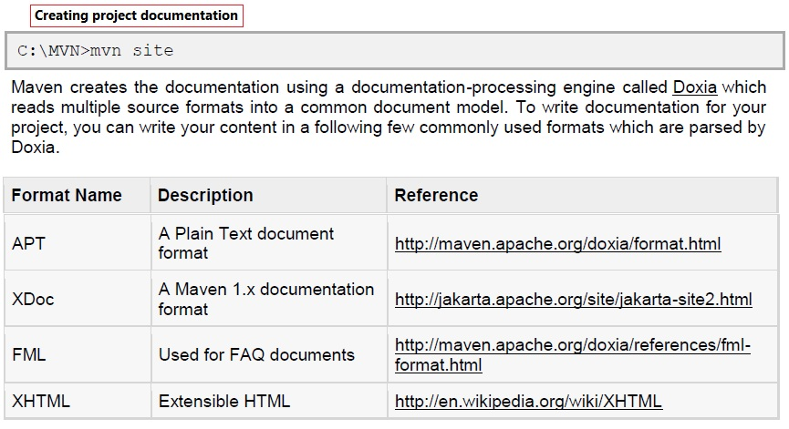

# Maven Commands
* Maven version
```
mvn -version
```
* Compile java classes
```
mvn compile
```
* Package - create jar/war/ear
```
mvn package
```
* Delete target directory
```
mvn clean
```
* Specify pom file name to execute
```
mvn -f pom-file-path/pom-file-name-with-extension targets-to-execute

mvn -f E:/core-java/my-pom.xml clean compile package
```
* Copy archive to local maven repository
```
mvn install
```
* Upload archive to remote repository like Nexus
```
mvn deploy
```
* Project dependencies in detail
```
mvn dependency:tree
```
* Install local jars to maven local repository
```
mvn install:install-file -Dfile=path-to-jar-file/ojdbc.jar -DgroupId=com.oracle -DartifactId=ojdbc6 -Dversion=11.2.0 -Dpackaging=jar
```
* Maven build timestamp
```
${maven.build.timestamp}

<maven.build.timestamp.format>yyyy-MM-dd HH:mm</maven.build.timestamp.format>
```
* Project dependencies are the dependencies declared in your pom. To copy them with their transitive dependencies
```
mvn dependency:copy-dependencies
```
* how to make maven force download dependencies from remote repository
```
mvn -U [goal]
mvn -U clean package
mvn --update-snapshots [goal]
mvn --update-snapshots clean package
```
* To run specific tests in a class from command prompt	
```
mvn clean test -Dtest=<test-class-name>
```
* Maven eclipse plugin
```
<plugin>
 <groupId>org.apache.maven.plugins</groupId>
  <artifactId>maven-eclipse-plugin</artifactId>
  <configuration>
     <downloadSources>true</downloadSources>
     <downloadJavadocs>true</downloadJavadocs>
  </configuration>
</plugin>
```
* Creating java project using maven archetype plugin
```
mvn archetype:generate -DgroupId=com.test -DartifactId=maven-hello-world -DarchetypArtifactId=maven-archetype-quickstart -DintetactiveMode=false
```
* Create web project using maven archetype plugin
```
mvn archetype:generate -DgroupId=com.test -DartifactId=test-web-app -Dpackage=com.example -DarchetypeArtifactId=maven-archetype-webapp -DinteractiveMode=false
```
* Create jersey implemented web application using maven archetype plug in
```
mvn archetype:generate -DgroupId=com.example -DartifactId=simple-service-webapp -DarchetypeGroupId=org.glassfish.jersey.archetypes -DarchetypeArtifactId=jersey-quickstart-webapp -DarchetypeVersion=2.22.2 -Dpackage=com.example -DinteractiveMode=false
```
* creating project documentation\
```
mvn site
```

* find outdated dependency versions from your modules
```
mvn versions:display-dependency-updates
```
* Compile test cases
```
mvn test-compile
```
* Skip Test cases
```
mvn install -Dmaven.test.skip=true
```
* Execute `build` target on running `package` target
```
<executions>
	<execution>
		<phase>package</phase>
		<goals>
			<goal>build</goal>
		</goals>
	</execution>
</executions>
```
* Run all test cases
```
mvn test
```
* Run all methods in specific test class
```
mvn test -Dtest=[fully-packaged-class-name]
mvn test -Dtest=com.test.EmployeeService
```
* Run full package
```
mvn test -Dtest="com.tests.**"
```
