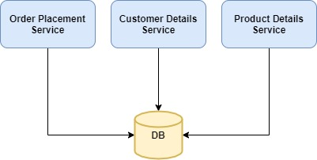
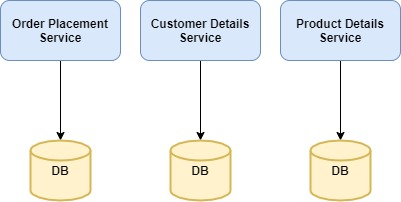
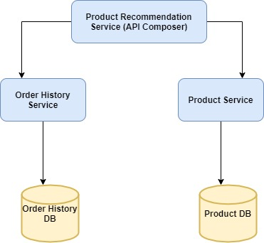
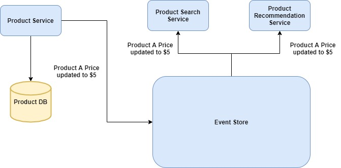
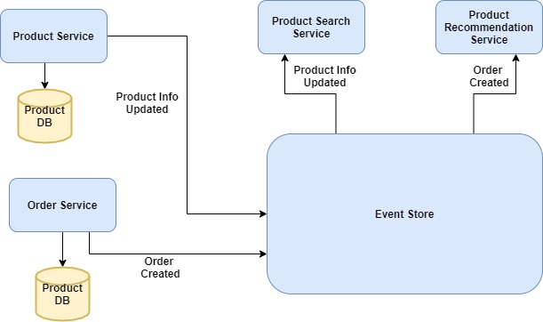
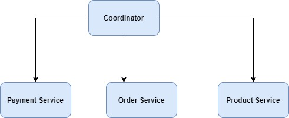
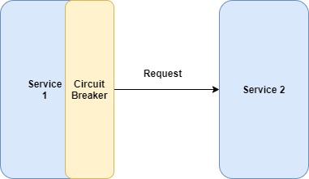
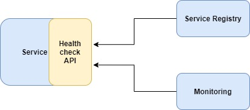

# Microservices with spring cloud topics
* spring cloud config server
* load balancing with Ribbon and Feign
* Naming server with Eureka
* API Gateway with Zuul
* Distributed tracing with Zipkin
* Fault tolerance with Hystrix

## What is microservice?
* REST API
* Small deployable units
* cloud enabled

## Challenges of microservices
* Bounded Context
	* Identifying the boundaries of microservice
* Configuration Management for below combinaiton of microservices
	* number of microservices
	* number of environments
	* number of instances in each environment
* Dynamic Scale Up and Scale Down
	* dynamically increasing and decreasing the instances
	* dynamically distribute load among running instances
* Visibility
	* we need to have centralized log to identify which microservice caused the problem
	* we need monitoring for all microservices. While multiple microservices are running we should be able to identify 
		* which microservice is down
		* which microservice is running out of disk space
* Pack of cards
	* we are building mulitple microservices and if one microservice is down there is chance of whole functionality gets effects
	* So we need to have fault tolerance

## Implementing microservices with spring cloud
* There are wide variety project under spring cloud. Refer https://spring.io/projects/spring-cloud
* Configuration Management is done with `Spring Cloud Config Server`
	* We can store configuration of all configurations of all different microservices for all environments in Git Repository
	* Saving all configurations in one single place
	* Spring cloud config server maintains all configuration in git repository
* Dynamic Scale Up and Scale Down
	* Naming Server and Discovery Server - Eureka
		* All microservices register with naming server
	* Ribbon - client side load balancing
	* Feign - Easier Rest client
* Visibility and Monitoring
	* Spring Cloud Sleuth
		* To assign an id to request across all microservices
	* Zipkin Distributed Tracing
		* To trace request across multiple components
	* Netflix API Gateway Zuul
		* Security
		* Logging
		* Routing
* Fault Tolerance
	* Hystrix
		* If service is down Hystrix helps us return default response

## Advantages of microservices
* Easy to adapt new technology stack
* Dynamic Scaling
* Faster release cycles

## Standardizing component ports and URLs
Application          				| Port
-------------------- 				| ---------------
Application Service 1         		| 8080, 8081
Spring Cloud Config Server  		| 8888
Application Service  2 				| 8000, 8001, 8002, ..
Application Service 3				| 8100, 8101, 8102, ..
Netflix Eureka Naming Server		| 8761
Netflix Zuul API Gateway Server		| 8765
Zipkin Distributed Tracing Server 	| 9411

## API Gateway
### Why API Gateway
* In microservices there are so many microservices that are talking to each other. There are common features that we need to implement for all these microservices like
	* Authentication, Authorization, Security
	* Rate Limits: Allowing certain number of calls for per client/user
	* Fault Tolerance
	* Service Aggregation
		* Like one consumer want to consume 10 of our microservices then it is better to aggregate and provide one common service
* Instead of calling each microservice calling other microservice directly we will go through API Gateway

## Ribbon
* Client/API Consumer side load balancing tool
* Examples
	* https://github.com/avinashbabudonthu/micro-services/tree/master/spring-cloud-config-client-feign-ribbon
	* https://github.com/avinashbabudonthu/micro-services/tree/master/spring-cloud-config-client-feign-ribbon-eureka
	
## Sleuth
* Assign unique id to a request so we that we can trace it across microservices
* Zipkin - distributed tracing server
	* Get logs from multiple microservices to one common place like Splunk
	
## Zipkin
* Centralized location to check all logs so that we can search by log-id assigned by `Sleuth`
* There are other tools also for centralized logging
	* ELK Stack
	* Kibana
* Zipkin server connects to database in backend

## Spring cloud Bus
* If we have multiple instances of multiple microservices running. All connected to config server. If any configuration changed then how that configuration will be applied to running instances of that microservices for that environment.  For this only we need Spring Cloud Bus
* We can implement Spring Cloud Bus using 
	* Kafka
	* Rabbit MQ
	
## Microservices Architecture
### References
* https://cloudacademy.com/blog/microservices-architecture-challenge-advantage-drawback/

# Microservices Software Architecture - Patterns and Techniques
* System is structured as collection of inter connected services
* Advantages
	* Low/Loose coupling
	* Improved modularity
	* Promotes parallel development
	* Promotes scalability
* Drawbacks
	* Infrastructure costs are usually higher
	* Integration testing complexity
	* Service management and deployment
	* Nonoservice anti pattern: nanoservice is anti pattern where service is too fine grained
## What microservice project template should contain
* cross cutting concerns
	* logging
	* metrics
	* connection setup and configuration to databases and message brokers
* project structure
* Some good microservice project templates
	* [https://github.com/Nike-Inc/riposte-microservice-template](https://github.com/Nike-Inc/riposte-microservice-template)
	* [https://github.com/overture-stack/microservice-template-java](https://github.com/overture-stack/microservice-template-java)
## Code Repository
* We can structure our code repositories to be either
	* Monolith: where all code will be contained inside the single repository. Google and Facebook follow this approach in handling their code repository structure
	* Discrete: codebase is split into several smaller repositories perhaps based on domain or component.
## Mono repo
* PROS
	* Easier to keep input/output containers in sync
	* Can version the entire repo with a build number
* CONS
	* Different teams working in the same repo can break the build, disrupting CI/CD for other teams
	* Easier to create tight coupling
	* Longer build times because of large code repo to download

## Discrete repo
* PROS
	* Different teams own different repositories
	* Scope of single repo is more clear
* CONS
	* Contract versioning becomes more complex
	* Unless managed properly, discrete repos can easily become mono repos
	* More up front cost in setting up repos and CI/CD pipeline

## Communication
* Inter service communication
	* Remore Procedure Invocation
		* Send request and receive response like REST API
	* Asynchronous message based communication
		* One microservice publish message to `Message Bus` like `MQ, Kafka` and other microservice consume it

## Microservice Registry
* Service registry component holds database of currently available instances and their network location

## Service Registration & Discovery - Getting Started
* Now that we've learned about service registration and discovery, here are some of the most commonly used components that are used to perform this functionality that you can consider using in your microservice environment: 
* Consul - [https://www.consul.io/](https://www.consul.io/)
	* A service mesh solution that provides a strongly consistent data store that can be used not only for service discovery purposes but also for health checking (we'll get to this in a later lecture!), as a configuration server and offers multi-datacenter support out of the box. Each of these features can be used independently. Consul is a popular choice not only because of its relative simplicity to set up but also because of its reliability, scalability and supporting features.
* Netflix Eureka - [https://github.com/Netflix/eureka](https://github.com/Netflix/eureka)
	* Eureka, that is part of the open souced Netflix stack, can be best described as an AWS Service registry for resilient mid-tier load balancing and failover. This is a good alternative if a simple load balancer is needed in a cloud environment, however, for additional features such as monitoring and configuration, you will either have to compliment this with additional tools or look at other alternatives.
* Apache Zookeeper - [https://zookeeper.apache.org/](https://zookeeper.apache.org/)
	* Often used with Apache Curator (http://curator.apache.org/), Zookeeper was one of the first tools to be used for distributed service coordination. As a result, it is very mature, robust and has many features available out of the box. In fact, it's used by quite a few big names in the industry such as YouTube and eBay.
	* However, being one of the older tools out there it's showing its age. Compared to its competitors it consumes significantly more resources and is more time-consuming to set up and maintain due to its dependencies and complexity. You most likely will end up using barely any of the extra features that are available, so you'll be suffering the hit of these disadvantages without any real benefit. As a result, it is a much less common choice nowadays and is usually found in more established companies where alternatives were not available at the time.
* Although you may not yet be in a position to actually require the use of a service registry/discovery component, I encourage you to take a brief look into the above components to help you get a better understanding of the functionalities they provide and how they help us maintain seamless communication.

## Database - Different patterns how data can be managed in microservices architecture
### Shared Database pattern

### Database Per Service Pattern

### API Composition
* In database per service pattern leads to challenges where query spanning data across multiple services are required. One solution to this is `API Composition` 
*In API Composition, a service referred to as API Composer queries data from multiple services and then performs in-memory join of data obtained and produce final result
* In this pattern if individual microservices complex queries then joining them API Composer will become complex. This can be solved using Event Sourcing shown below

### Event Sourcing
* Help services to keep check of state changes of objects\

* Solution to API Composer issue by using Event Source
\
* Event sourcing is rapidly gaining popularity in particular in large companies with enterprise systems that need to handle a high volume of concurrent events, so becoming more familiar with them is definitely a good investment both for your personal knowledge and your future career prospects! Although in the previous lecture we went through the core principles in the previous lecture, we didn't go into technical details. Therefore, I'll now be introducing you to some of the most well-known event stores and event sourcing frameworks to help you get started.
* AxonIQ (Java) - [https://axoniq.io/](https://axoniq.io/)
	* Axon is an open-source Java framework and server that supports event-driven microservices. It provides implementations of the most important building blocks when developing event-driven micro-services following domain-driven design, such as aggregates, command and event buses, and repositories. It is a robust and reliable framework that has a free version as well as an enterprise edition with some extra features, however, the free edition already offers more than you'll need to get started. Specifically for event-sourcing, here's an official article explaining how the Axon Server fits in as an event store when using the Axon framework to implement event sourcing: https://axoniq.io/resources/event-sourcing.
* Event Store (All programming languages) - [https://eventstore.com/](https://eventstore.com/)
	* If you prefer not to use a full framework, or if you just want to build most of the stuff yourself to get a better understanding of what's going on - a good option is to download the Event Store database that was built specifically with event sourcing in mind. It 's free and open-source, with clients for different languages as well as access to functionality via an HTTP web API, making it a viable option to use with just about any programming language.
* Event Sourcing in Python - [https://github.com/johnbywater/eventsourcing](https://github.com/johnbywater/eventsourcing)
	* A well-maintained library that facilitates event sourcing in Python. Apart from an event store, it also supplies features such as concurrency control and snapshotting. The Github repository also contains comprehensive documentation and examples, making it easy to get started.
* NEventStore (C#) - [https://github.com/NEventStore/NEventStore](https://github.com/NEventStore/NEventStore)
	* NEventStore is a persistence library used to abstract different storage implementations when using event sourcing as a storage mechanism. It contains enterprise-ready features, is very well documented and is actively maintained. It might look daunting at first but it's definitely a viable long term solution.
* Equinox Project (C#) - [https://github.com/EduardoPires/EquinoxProject](https://github.com/EduardoPires/EquinoxProject)
	* Although not specifically dedicated to event sourcing, the Equinox Project still deserves a mention as it's definitely a good starting point for C# developers. This is an open-source project written in .NET Core, that implements the most commonly used technologies including a good foundation for event sourcing. On the other hand, it doesn't include a fully-fledged event store as NEventStore does, so if you're specifically after an event store then I recommend taking a look at NEventStore first.

## Two phase commit
* In distributed database (like database per service pattern) two phase commit is used to maintain transactions

* Phase 1: Commit Request
	* Coordinator sends query to commit message
	* Services executes transaction but do not commit
	* Reply yes/no depending on if they were successful
* Phase 2: Commit
* If all services reply yes
	* coordinator sends commit messge
	* services commit the transaction
	* Reply with acknowledgement
* If atlease one service replied with no
	* coordinator sends rollback message
	* services rollback the transaction
	
## Saga Pattern
* Alternative to two phase commit to manage distributed transactions
* Saga can be considered a sequence of local transactions in different microservices. Each local transaction updates the database of the microservice and then publishes message or event to trigger next local transaction in the Saga
* If one transaction fails, then saga executes series of compensating transactions that rollback changes of local transactions
* Advantages of saga patten 
	* Enables application to maintain data consistency across multiple services
	* however, as you can see the development process becomes more complex and also takes longer as compensating actions need to be developed for each transaction to be able to rollback
* Microservice should publish the event and update the database atomically to prevent race conditions and potential data inconsistency
* 2 Types of saga patterns
	* Choreography based sagas
	* Orchestrator based sagas
## Choreography based sagas

## Orchestrator based sagas
* Orchestrator spawned specifically each saga, instructs microservices involved in the saga what local transactions to execute. It coordinates whole saga\

* Order service creates order saga
* Order service instruct payment service to request payment and wait for message indicating payment was successful. If not order creation service terminates immediately and not more actions are required. If payment received successfully, then order creation saga sends message to order service to create an order. then order service relies to order creation saga whether order created successfully. If order wasn't created successfully then order creatio saga instruct payment service to rollback it's previous actions and then saga terminates. If order created successfully then order creation saga sends message to product service to reserve products. Product service will reply a message indicating if the product reserved successfully, if so then saga can terminate as no further actions are required in the saga. If product service did not manage to reserve the products then order creation saga will notify both order service and payment service to roll back previous actions they have taken in the saga. 

# Failover Mechanism
* It is important to have high availability of resources in microservices world
## Cricuit Breaker
* When service sends synchronous request to another service, it's possible that other service is unavailable or on too much load to respond in reasonable period\

* some of the more popular circuit breaker libraries and I'll also link a few additional ones that you can take a look at before choosing one for your microservice template.
* Netflix Hystrix - [https://github.com/Netflix/Hystrix](https://github.com/Netflix/Hystrix)
	* Part of the Netflix open source stack, this Java library is designed to handle latency and fault tolerance when accessing remote parts of the system, services, or third parties. By applying the circuit breaker pattern, it helps prevent failures in one part of the system from cascading throughout the whole system, making it more robust and resilient to failure. It also allowed for:
	* rapid recovery
	* real-time monitoring and alerting
	* making use of fallbacks to retain limited functionality in abnormal circumstances
	* Whilst this was considered one of the most reliable libraries at one point, Netflix announced that they are putting the project on maintenance mode and are moving towards active projects such as resilience4j [https://github.com/resilience4j/resilience4j](https://github.com/resilience4j/resilience4j) rather than continuing to actively improve Hystrix.
	* Therefore, if you were considering Hystrix I would recommend going directly to resilience4j since Hystrix won't be actively maintained long term.
* Sentinel - [https://github.com/alibaba/Sentinel](https://github.com/alibaba/Sentinel)
	* Open-sourced by Alibaba in 2018, this is another mature library that offers similar functionality to Hystrix whilst being a bit more efficient in how it manages resources by avoiding thread pool isolation per dependency which Hystrix does. In practice, this overhead is generally negligible from a user perspective, however. The project is actively maintained and is a good option to consider if you are using Java.
	* As you can see, Java developers are quite spoilt for choice when it comes to well-known circuit breaker libraries! Let's take a look at some options if you're using other programming languages:
* Python
	* PyBreaker [https://github.com/danielfm/pybreaker](https://github.com/danielfm/pybreaker) - a circuit breaker implementation that has been around a while and is still actively maintained. It guarantees thread safety and also has some useful additional features such as optional Redis backing.
* C#
	* Polly [https://github.com/App-vNext/Polly](https://github.com/App-vNext/Polly) is one of the most popular and reliable circuit breaker implementations that allows the user to describe retry and fallback policies in a fluent manner whilst guaranteeing thread safety. It's well documented and actively maintained.
	
# Health check API
* Health check should be avaialble on all microservices that expose API endpoint
* This API can be consumed to obtain service status
* 200 - Ok - service healthy
* 500 - service not healthy
* Health check API generally frequently called by service registry to check the if service available to direct traffic to it
* Also used by monitoring services in order to raise alerts if the service is an unhealthy state\

# Logging Techniques
* Technologies allow log tracking
	* ElasticSearch
	* LogStash
	* Kibana Stack
	* Splunk
	* AWS Cloud Watch