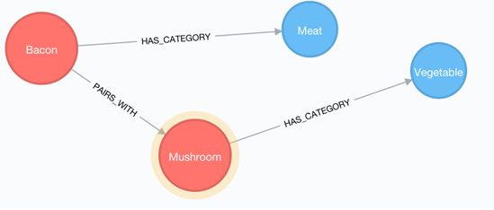

# Notes
* Highly scalable open source graph database
* Supports `ACID` properties
* Has web based administration tools that includes full transaction support
* Accessible from most of programming languages
* Has build in REST API
------
# Neo4j Data Model
* Neo4j Database follows the Property Graph Model for storing and managing its data. Neo4j is a graph database which contains the following features of Property Graph Model.
  * The Graph model contains Nodes, Relationships and Properties which specifies data and its operation.
  * Properties are key-value pairs.
  * Nodes are represented using circle and Relationships are represented using arrow keys. Relationship specifies the relation between two nodes.
  * There are two types of relationships between nodes according to their directions: Unidirectional and Bidirectional
  * Each Relationship contains two nodes: "Start Node" or "From Node" and "To Node" or "End Node".
  * Both Nodes and Relationships contain properties.
* Relationships should be directional in Property Graph Data Mode. If you create a relationship without a direction, it will through an error message.
* There are three main building block of a GraphDB Data model:
  * Nodes
  * Relationship
  * Properties\
 
