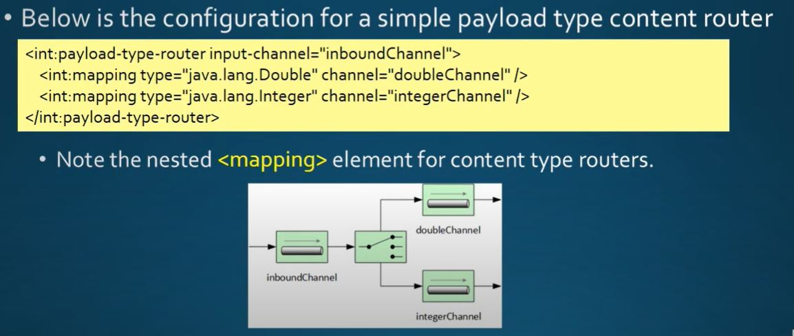
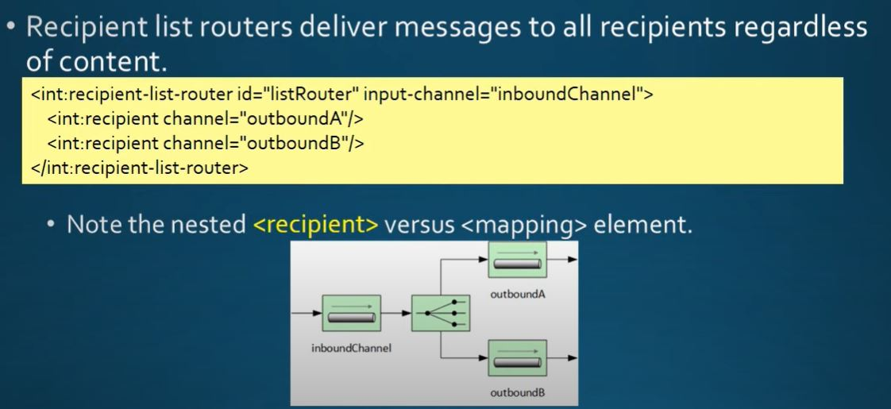

# Spring Integration Notes

# Main Components
* Endpoints
	* Producer (Sender)
	* Consumer (Receiver)
* Channels
	* Pipe

# Communication
* Produer send `Message` to consumer
* Message contains
	* Header - Contains system information for example timestamp when message is created
	* Content (payload) - information to be exchanged between applications\
* 

# Types of Message Endpoints
* Adapters
	* connect our channel to some other system
* Filter
	* remove some messages from channel based on header, content etc
* Transformer
	* convert message content or structure
* Router
	* Content Routers - To one of the channels based on content
	* Recipient list Routers - To all channels
* Enricher
	* Add content to message header or payload
* Service activator
	* invoke service operations based on the arrival of message
* Gateway
	* connect your channels without SI (Spring Integration) coupling
------
# Message channels
* 2 types
	* Pollable channel
	* Subscribable channel
* There are many subtypes, all implement at least of one of the spring integration channel interfaces
* Message channels are represented by the `pipe` icon
------
# Pollable channels
* Buffers messages
	* Require queue to hold the messages
	* Queue has designated capacity
* Waits for consumer to get the messages
	* Conumers actively poll to receive messages
* Typically point-to-point channel
	* Only one receiver of message in the channel
* Usually used for sending information or `document` messages between end points
------
# Subscriber
* Allows multiple subscribers to register for its messages
	* Messages are delivered to all registered subscribers on message arrival
	* It has to manage list or registry of subscribers
* Doesn't buffer messages
* Usually used for `event` messages
	* Notifying subscribers that something happened and take appropriate action
------
# Adapters
* Endpoint connects a channel with external system
	* Definition - It provides bridge between spring integration and external systems and services
	* Providing separation of messaging concerns from the transports and protocols used
* Adapters are inbound or outbound
	* Inbound - Brings messages into SI channels
	* Outbound - Get messages from SI channel to outside applications, databases etc
* Adapters are represented by following icons in EIP diagrams\

* Comes with number of built in adapters
	* Stream adapters (like standard Input and Output stream adapters)
	* File Adapters
	* JMS Adapters
	* JDBC & JPA Adapters
	* FTP and Secure FTP Adapters
	* Feed (RSS, Atom etc) Adapters
	* Mail Adapters
	* MongoDB Adapters
	* UDP Adapters
	* Twitter Adapters
* Adapters may (usually does) require the addition of another SI module
------
# Router
* Content Router\

* Recipient list Router\

------
# Service activator
* Message endpoing connect spring object or bean to message channel
	* Object or bean as service
	* Service is triggered by the arrival of message into channel
* Output of service sent to output channel\

* Icon for service activator\

* Service activator configuration must specify the message channel that is polls for messages and the calss of the service bean
	* If service produces results, the output is sent to an output channel
* Argument to service method could be either Message or an orbitrary type
* When service method has not arguments, that service activator called as `event-style Service Activator`
------
# Gateway
* Spring integration gateways serves as facade to Spring integration system
	* It hides SI API or any messaging API from the application
	* Gateway is defined by an interface
	* SI implements gateway interface under the covers
* 2 types of gateways
	* Synchronous gateways - cause application to block while SI system process the request
	* Asynchronous gateways - allows application to continue and retrieve results from the SI process later
* Icon for Gateway\
