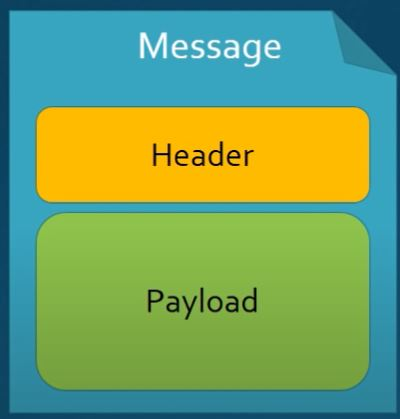

# Spring Integration Notes

# Main Components
* Endpoints
	* Producer (Sender)
	* Consumer (Receiver)
* Channels
	* Pipe

# Communication
* Produer send `Message` to consumer
* Message contains
	* Header - Contains system information for example timestamp when message is created
	* Content (payload) - information to be exchanged between applications\
* 

# Types of Message Endpoints
* Adapters
	* connect our channel to some other system
* Filter
	* remove some messages from channel based on header, content etc
* Transformer
	* convert message content or structure
* Enricher
	* Add content to message header or payload
* Service activator
	* invoke service operations based on the arrival of message
* Gateway
	* connect your channels without SI (Spring Integration) coupling
------
# Message channels
* 2 types
	* Pollable channel
	* Subscribable channel
* There are many subtypes, all implement at least of one of the spring integration channel interfaces
* Message channels are represented by the `pipe` icon
------
# Pollable channels
* Buffers messages
	* Require queue to hold the messages
	* Queue has designated capacity
* Waits for consumer to get the messages
	* Conumers actively poll to receive messages
* Typically point-to-point channel
	* Only one receiver of message in the channel
* Usually used for sending information or `document` messages between end points
------
# Subscriber
* Allows multiple subscribers to register for its messages
	* Messages are delivered to all registered subscribers on message arrival
	* It has to manage list or registry of subscribers
* Doesn't buffer messages
* Usually used for `event` messages
	* Notifying subscribers that something happened and take appropriate action
------
# Adapters
* Endpoint connects a channel with external system
	* Definition - It provides bridge between spring integration and external systems and services
	* Providing separation of messaging concerns from the transports and protocols used
* Adapters are inbound or outbound
	* Inbound - Brings messages into SI channels
	* Outbound - Get messages from SI channel to outside applications, databases etc
* Adapters are represented by following icons in EIP diagrams\
